# No Instruments, No Delivery: The Enterprise Agentic Imperative

*A thought leadership guide for technical leaders navigating agentic AI adoption*

---

## The Shift: From Coders to Captains

For decades, we've measured developer productivity in the wrong units. Lines of code. Commits per day. Story points burned. These metrics made sense when programming was primarily about translating human intent into machine instructions—when the bottleneck was typing speed and syntax knowledge.

That era is ending.

AI coding assistants don't just autocomplete your brackets. Modern agentic AI systems can write entire features, refactor codebases, generate test suites, and iterate on solutions autonomously. The mechanical act of "coding" is being automated at an accelerating pace.

This terrifies some leaders. It shouldn't. Here's why.

**The shift isn't from "developer" to "obsolete." It's from "Coder" to "Captain."**

Consider what a commercial airline pilot actually does. They don't hand-fly the aircraft for most of the journey. Modern aircraft have sophisticated autopilot systems that handle altitude, heading, speed, and even landing in low-visibility conditions. The autopilot does the mechanical work of flying.

But no one suggests we don't need pilots.

The question for enterprise leaders isn't "Will AI replace our developers?" It's "Are our developers equipped to fly?"

And critically: **Do they have the system around them to fly safely?**

---

## The System: How Flight Operations Work

Before we zoom into the cockpit, let's understand the entire system that makes flight possible. Aviation isn't just pilots and planes—it's a coordinated ecosystem where every role is essential.

```mermaid
flowchart TB
    faa["🏛️ <b>FAA</b><br/>Security / Compliance<br/><br/>• Set regulations<br/>• Certify aircraft<br/>• Audit operations<br/>• Enforce standards"]

    atc["🗼 <b>AIR TRAFFIC CONTROL</b><br/>CTO / VP Engineering<br/><br/>• Strategic coordination<br/>• Airspace allocation<br/>• Conflict resolution<br/>• System-wide visibility"]

    ground["🔧 <b>GROUND CREW</b><br/>Platform / DevOps<br/><br/>• Maintain instruments<br/>• Prepare runways<br/>• Fuel aircraft<br/>• Service between flights"]

    pilots["👨‍✈️ <b>PILOTS</b><br/>Developers<br/><br/>• Fly missions<br/>• Monitor instruments<br/>• Make go/no-go calls<br/>• Take responsibility"]

    autopilot["🤖 <b>AUTOPILOT</b><br/>Agentic AI<br/><br/>• Execute flight plan<br/>• Maintain heading<br/>• Handle routine ops<br/>• Report status"]

    faa --> atc
    faa --> ground
    faa --> pilots
    atc --> pilots
    ground --> pilots
    pilots --> autopilot

    style faa fill:#4a1d96,stroke:#a855f7,stroke-width:3px,color:#fff
    style atc fill:#1e3a5f,stroke:#4a9eff,stroke-width:3px,color:#fff
    style ground fill:#422006,stroke:#f59e0b,stroke-width:3px,color:#fff
    style pilots fill:#0d2818,stroke:#22c55e,stroke-width:3px,color:#fff
    style autopilot fill:#1a1a2e,stroke:#6b7280,stroke-width:3px,color:#fff
```

*Caption: The Complete Flight Operations System — Every role is essential. Pilots command the autopilot, but they can't fly without ground crew maintaining their instruments, ATC coordinating the airspace, and the FAA setting the rules.*

### 🤖 Autopilot → Agentic AI

The autopilot doesn't replace the pilot—it handles the mechanical work of flying so the pilot can focus on judgment, decision-making, and responsibility.

In software delivery, **agentic AI is your autopilot**. It:
- **Executes the flight plan** — Writes code according to specifications
- **Maintains heading** — Stays on task, iterates toward the goal
- **Handles routine operations** — Tests, refactors, generates boilerplate
- **Reports status** — Surfaces what it's doing and what it finds

Autopilot is powerful. But autopilot without a pilot is just an expensive way to crash.

### 👨‍✈️ Pilots → Developers

Pilots do something far more valuable than manipulate controls. They:
- **Plan the mission** — Route selection, fuel calculations, weather assessment
- **Make go/no-go decisions** — Is it safe to fly today?
- **Monitor instruments** — Continuous situational awareness
- **Intervene when necessary** — Handle anomalies, adjust to changing conditions
- **Execute critical phases** — Takeoff and landing require human judgment
- **Take responsibility** — The pilot is accountable for the flight's outcome

This is exactly what developers become in an agentic world. They're not faster typists with AI assistance. They're **flight captains** who plan, monitor, steer, and take responsibility for outcomes while AI handles the mechanical execution.

### 🗼 Air Traffic Control → CTO / VP Engineering

ATC doesn't fly aircraft, but they make flight possible at scale. They:
- **Coordinate multiple flights** — Which teams are working on what? Where are the conflicts?
- **Allocate airspace** — Who owns which parts of the codebase? What are the change windows?
- **Resolve conflicts** — When two teams need the same runway (production deployment slot), who goes first?
- **Maintain system-wide visibility** — What's the overall health of the fleet? Where are the bottlenecks?

In an agentic world, ATC becomes more important, not less. With developers flying multiple concurrent missions, coordination complexity increases. Someone needs to see the big picture.

### 🔧 Ground Crew → Platform / DevOps

Ground crew keeps the aircraft flying. They:
- **Maintain instruments** — Build and operate the dashboards, pipelines, and monitoring systems
- **Prepare runways** — Ensure deployment targets are ready to receive code
- **Fuel aircraft** — Provision resources, manage infrastructure
- **Service between flights** — Clean up environments, maintain tooling

The ground crew's work is invisible when it's done well. But without them, pilots have no instruments, no runways, and no fuel. The agentic multiplier depends entirely on ground crew excellence.

### 🏛️ FAA → Security / Compliance

The FAA sets the rules everyone follows. They:
- **Set regulations** — What security standards must code meet? What compliance frameworks apply?
- **Certify aircraft** — Approve tooling, libraries, and patterns for use
- **Audit operations** — Verify that teams are following the rules
- **Enforce standards** — Block deployments that don't meet requirements

Security and compliance teams often feel like they're slowing things down. In the agentic world, they're enabling speed. Clear regulations mean pilots know exactly what "green" looks like on their compliance instrument. Automated enforcement means unsafe code is caught early, not in production.

---

*Now let's zoom into the cockpit and see what pilots actually work with.*

---

## The Cockpit: Your Six Pack

Every pilot learns the "six-pack"—the six primary flight instruments that provide essential situational awareness. These instruments tell the pilot: Am I climbing or descending? Am I turning? Am I going the right speed? Am I at the right altitude? Will I arrive where I intend to go? And am I safe to continue?

Without these instruments, a pilot in clouds is flying blind. Spatial disorientation sets in within seconds. Accidents follow within minutes.

Developers flying agentic missions need their own "Six Pack". These are the instruments that answer: Is this code safe to ship? Is it legal to deploy? Will it perform? Can we roll it back?

```mermaid
flowchart TB
    subgraph cockpit["🎛️ DEVELOPER INSTRUMENT PANEL                    "]
        direction TB
        subgraph row1[" "]
            direction LR
            test["🧪 TEST HEALTH<br/>━━━━━━━━━━<br/>Coverage: 94%<br/>Passing: 847/847<br/>🟢 ALL CLEAR"]
            security["🔒 SECURITY<br/>━━━━━━━━━━<br/>Critical: 0<br/>High: 0<br/>🟢 CLEAN SCAN"]
            perf["⚡ PERFORMANCE<br/>━━━━━━━━━━<br/>P95: 142ms<br/>Baseline: 150ms<br/>🟢 WITHIN BOUNDS"]
        end
        subgraph row2[" "]
            direction LR
            compliance["📋 COMPLIANCE<br/>━━━━━━━━━━<br/>SOC2: Clean<br/>FedRAMP: Clean<br/>🟢 ATTESTED"]
            deploy["🚀 DEPLOY WINDOW<br/>━━━━━━━━━━<br/>Status: Open<br/>Next freeze: 14d<br/>🟢 CLEAR"]
            deps["📦 DEPENDENCIES<br/>━━━━━━━━━━<br/>CVEs: 0<br/>Updates: 2 minor<br/>🟢 HEALTHY"]
        end
    end

    style cockpit fill:#1a1a2e,stroke:#4a9eff,stroke-width:2px
    style test fill:#0d2818,stroke:#22c55e,stroke-width:2px
    style security fill:#0d2818,stroke:#22c55e,stroke-width:2px
    style perf fill:#0d2818,stroke:#22c55e,stroke-width:2px
    style compliance fill:#0d2818,stroke:#22c55e,stroke-width:2px
    style deploy fill:#0d2818,stroke:#22c55e,stroke-width:2px
    style deps fill:#0d2818,stroke:#22c55e,stroke-width:2px
```

*Caption: Developer Instrument Panel — The six readings that determine flight readiness. All green means cleared for deployment. Any red grounds the flight.*

Let's examine each instrument:

### 🧪 Test Health

**What it measures:** Are we building the right thing correctly?

| Reading | Status | Meaning |
|---------|--------|---------|
| 🔴 Red | Tests failing | **No takeoff.** Broken code doesn't fly. |
| 🟡 Yellow | Coverage declining | **Proceed with caution.** New code isn't tested—risk accumulating. |
| 🟢 Green | All passing, coverage stable | **Clear.** Confidence in correctness. |

Test health is your attitude indicator—the instrument pilots check most frequently. It tells you if you're oriented correctly relative to your goal. When this goes red, everything else becomes unreliable.

### 🔒 Security Posture

**What it measures:** Are we safe to deploy?

| Reading | Status | Meaning |
|---------|--------|---------|
| 🔴 Red | Critical vulnerability found | **No takeoff.** You're about to put a hole in your fuselage. |
| 🟡 Yellow | Medium findings | **Proceed with caution.** Acceptable risk, but track and remediate. |
| 🟢 Green | Clean scan | **Clear.** No known vulnerabilities in this change. |

Security is your airspeed indicator. Too slow (too little security) and you stall—an attacker exploits you and you fall out of the sky. Too aggressive (blocking everything) and you never get anywhere. The right reading is "safe enough to fly this mission."

### ⚡ Performance Baseline

**What it measures:** Will this perform in production?

| Reading | Status | Meaning |
|---------|--------|---------|
| 🔴 Red | Regression detected | **No takeoff.** You're about to make things worse. |
| 🟡 Yellow | Near threshold | **Proceed with caution.** You're close to limits. |
| 🟢 Green | Within bounds | **Clear.** Performance acceptable. |

Performance is your altimeter. It tells you how much headroom you have. A performance regression means you're losing altitude—keep going and you hit the ground.

### 📋 Compliance Gates

**What it measures:** Are we legal to ship?

| Reading | Status | Meaning |
|---------|--------|---------|
| 🔴 Red | PII in logs, non-FIPS crypto, or missing required audit trail. | **No takeoff.** You literally cannot legally deploy. |
| 🟡 Yellow | Code is compliant but uses discouraged patterns that may be blocked in future
 | **Proceed with caution.** Plan your landing before this expires. |
| 🟢 Green | All compliance scans passing | **Clear.** All certifications valid. |

Compliance is your navigation system. It tells you if you're allowed to be where you're going. Flying into restricted airspace—deploying code that violates SOC2, HIPAA, FedRAMP, or GDPR—has consequences far beyond a failed build.

### 🚀 Deployment Window

**What it measures:** Is it safe to deploy right now?

| Reading | Status | Meaning |
|---------|--------|---------|
| 🔴 Red | Blocked/frozen | **No takeoff.** The runway is closed. |
| 🟡 Yellow | Restricted hours | **Proceed with caution.** Limited support available. |
| 🟢 Green | Open | **Clear.** Full support, normal operations. |

Deployment windows are your weather radar. Perfect code deployed during a change freeze is still a disaster. This instrument tells you if conditions support a safe landing.

### 📦 Dependency Health

**What it measures:** Is our supply chain secure?

| Reading | Status | Meaning |
|---------|--------|---------|
| 🔴 Red | CVE in dependencies | **No takeoff.** Your aircraft has known defects. |
| 🟡 Yellow | Updates available | **Proceed with caution.** Technical debt accumulating. |
| 🟢 Green | All current | **Clear.** Supply chain healthy. |

Dependencies are your fuel gauge. You didn't refine the fuel—you trusted your supply chain. A CVE in a dependency is contaminated fuel. It doesn't matter how well you fly; you're going down.

---

## The Flight: Phases of Agentic Delivery

A flight has distinct phases, each with different levels of automation and human involvement. Agentic software delivery follows the same pattern.

```mermaid
flowchart TB
    subgraph row1[" "]
        direction LR
        subgraph preflight["✈️ PRE-FLIGHT — Human Authority Required"]
            direction TB
            p1["📋 Check instruments"]
            p2["🗺️ File flight plan"]
            p3["⛽ Verify resources"]
            p4["✅ Go/No-go decision"]
        end

        subgraph takeoff["🛫 TAKEOFF — Human Authority Required"]
            direction TB
            t1["🎯 Define task scope"]
            t2["🤖 Initialize agent"]
            t3["📍 Set guardrails"]
            t4["▶️ Begin execution"]
        end
    end

    subgraph row2[" "]
        direction LR
        subgraph cruise["✈️ CRUISE — AI Autonomy + Human Monitoring"]
            direction TB
            c1["👁️ Monitor instruments"]
            c2["🔄 Steer as needed"]
            c3["⚠️ Handle turbulence"]
            c4["🤖 AI executes"]
        end

        subgraph landing["🛬 LANDING — Human Authority Required"]
            direction TB
            l1["✅ Verify completion"]
            l2["📊 Check all instruments"]
            l3["🔐 Attest quality"]
            l4["🚀 Deploy"]
        end
    end

    preflight --> takeoff
    takeoff --> cruise
    cruise --> landing

    style preflight fill:#1e3a5f,stroke:#4a9eff,stroke-width:3px
    style takeoff fill:#1e3a5f,stroke:#4a9eff,stroke-width:3px
    style cruise fill:#0d2818,stroke:#22c55e,stroke-width:3px
    style landing fill:#1e3a5f,stroke:#4a9eff,stroke-width:3px
    style row1 fill:transparent,stroke:transparent
    style row2 fill:transparent,stroke:transparent
```

*Caption: Agentic Delivery Lifecycle — Blue phases require human authority. Green phase is AI-autonomous with human monitoring. Humans control the boundaries; AI operates within them.*

### Pre-Flight: Human Authority Required

Before any flight, the pilot conducts a pre-flight inspection. They check the aircraft, review weather, file a flight plan, calculate fuel requirements, and make the **go/no-go decision**.

In agentic delivery, pre-flight means:

- **Check instruments** — Are all six readings green? If any are red, you don't fly.
- **File the flight plan** — What's the task scope? What are the acceptance criteria? What are the boundaries the agent must not cross?
- **Verify resources** — Do we have the context the agent needs? Are the right files, docs, and APIs accessible?
- **Go/no-go decision** — Is it safe and appropriate to start this agentic session?

This phase is entirely human. The AI hasn't started yet. The developer is establishing the conditions for a safe flight.

### Takeoff: Human Authority Required

Takeoff is the most dangerous phase of flight. The aircraft transitions from ground to air, committed to flight with limited options if something goes wrong.

In agentic delivery, takeoff means:

- **Define task scope** — Clear, bounded instructions for the agent
- **Initialize the agent** — Start the agentic session with appropriate context
- **Set guardrails** — What files can be modified? What actions are permitted?
- **Begin execution** — The agent starts working

The developer is still in direct control here. They're providing the initial instructions, setting constraints, and making sure the agent starts in the right direction. Once the agent is "airborne," the dynamic shifts.

### Cruise: AI Autonomy with Human Monitoring

Cruise is where autopilot shines. The aircraft is stable, conditions are (usually) predictable, and the mechanical work of maintaining heading and altitude is handled automatically.

In agentic delivery, cruise means:

- **AI executes** — The agent writes code, runs tests, iterates on solutions
- **Human monitors instruments** — Test status, security scans, performance benchmarks
- **Human steers as needed** — Provide clarification, redirect when off course
- **Handle turbulence** — Unexpected errors, changing requirements, new information

This is the phase where AI delivers massive value. The agent is writing code, potentially across multiple files, iterating based on test results, and making progress without the developer typing every character.

But the developer isn't idle. They're watching instruments. They're ready to intervene. They're maintaining situational awareness.

The developer who "starts an agent and walks away" is the pilot who "engages autopilot and takes a nap." It works—until it doesn't. And when it doesn't, you don't have time to wake up.

### Landing: Human Authority Required

Landing is the second-most dangerous phase. The aircraft transitions from air to ground, requiring precise control and judgment.

In agentic delivery, landing means:

- **Verify completion** — Did the agent accomplish the objective?
- **Check all instruments** — Final scan of all six readings
- **Attest quality** — Sign off that this code meets standards
- **Deploy** — Push to production (or merge, or whatever "done" means)

This phase is human authority. The agent may have written perfect code, but the developer makes the decision to ship. The developer's name is on the commit. The developer takes responsibility.

**No code deploys without a pilot signing off.**

---

## The Multiplier: One Pilot, Multiple Aircraft

Here's where the aviation metaphor reveals something profound about agentic AI's potential.

In aviation, one pilot flies one plane. It's a regulatory requirement, a safety constraint, and a practical reality. No human can maintain situational awareness across multiple concurrent flights.

In software development, that constraint doesn't exist.

```mermaid
flowchart TB
    pilot["👨‍✈️ DEVELOPER<br/>━━━━━━━━━━<br/>Monitoring 3 flights<br/>All instruments visible<br/>Intervention ready"]

    subgraph flights["CONCURRENT AGENTIC SESSIONS"]
        direction LR

        subgraph f1["Flight 1: Feature A"]
            a1["🤖 Agent working"]
            a2["🧪 Tests: 🟢"]
            a3["🔒 Security: 🟢"]
        end

        subgraph f2["Flight 2: Feature B"]
            b1["🤖 Agent working"]
            b2["🧪 Tests: 🟡"]
            b3["🔒 Security: 🟢"]
        end

        subgraph f3["Flight 3: Bug Fix"]
            c1["🤖 Agent working"]
            c2["🧪 Tests: 🟢"]
            c3["🔒 Security: 🟢"]
        end
    end

    pilot --> f1
    pilot --> f2
    pilot --> f3

    style pilot fill:#4a1d96,stroke:#a855f7,stroke-width:2px
    style f1 fill:#0d2818,stroke:#22c55e,stroke-width:2px
    style f2 fill:#422006,stroke:#f59e0b,stroke-width:2px
    style f3 fill:#0d2818,stroke:#22c55e,stroke-width:2px
```

*Caption: The Agentic Multiplier — One developer managing three concurrent agentic sessions. Throughput is limited by instrument monitoring capacity, not typing speed. Flight 2 shows a yellow indicator—the developer will investigate before that code lands.*

A skilled developer with good instruments can supervise multiple agentic sessions simultaneously. Not because they're typing faster, but because:

1. **Instruments aggregate status** — A dashboard showing three flights' worth of test/security/compliance status is manageable
2. **Cruise is autonomous** — While agents are executing, the developer isn't actively doing anything except monitoring
3. **Intervention is surgical** — When a developer needs to steer, it's a targeted correction, not continuous control
4. **Critical phases are sequential** — Pre-flight and landing still require focused attention, but they're bounded in time

**The limit isn't typing speed. The limit is instrument monitoring capacity.**

A developer with no instruments can barely manage one agentic session—they're constantly checking manually, losing context, and risking surprises. A developer with excellent instruments can manage three, four, maybe more concurrent flights.

This is the labor multiplier that enterprises desperately want from AI. Not "developers type faster." Not even "developers think faster." Instead: **developers can fly more missions in the same time.**

But here's the catch—and this is the critical insight for enterprise leaders:

**You cannot fly multiple aircraft without instruments.**

Try to supervise three agentic sessions without dashboards for test status, security scans, and compliance gates? You're flying three planes in fog with no instruments. It's not brave; it's reckless. It won't end well.

The organizations that capture the agentic multiplier aren't those with the most developers. They're those whose developers can safely fly the most planes.

And that requires investment in instruments.

---

## No-Fly Zones: What AI Must Never Do Alone

Autopilot is powerful, but it has limits. There are conditions where the pilot must take direct control, and there are actions that autopilot simply isn't allowed to perform.

The same is true for agentic AI. Here are the flight plan violations—the actions an agent must never take autonomously:

### 🚫 Production Database Schema Changes

**Why it's a no-fly zone:** Schema changes are irreversible at scale. A dropped column, a modified constraint, or a corrupted migration can cascade into data loss, application failures, and compliance violations.

**The rule:** Agents can *propose* schema changes. Agents can *generate* migration scripts. But executing schema changes against production requires human authorization, reviewed migration plans, and verified rollback procedures.

### 🚫 Security Control Bypasses

**Why it's a no-fly zone:** "The security scan is blocking my deploy, let me just skip it" is how breaches happen. Security gates exist because humans decided they were necessary.

**The rule:** Agents cannot disable security scans, skip compliance checks, or bypass approval gates. If an agent's code fails a security check, the agent iterates until it passes—or a human intervenes to assess the risk.

### 🚫 Unapproved Dependencies

**Why it's a no-fly zone:** Every dependency is a trust decision. You're importing someone else's code into your application. Supply chain attacks (SolarWinds, Log4j, XZ Utils) demonstrate the stakes.

**The rule:** Agents can only add dependencies from an approved list. New dependencies require human review, security assessment, and explicit approval before they enter the codebase.

### 🚫 Production Configuration Changes

**Why it's a no-fly zone:** Feature flags, environment variables, and runtime configuration can change application behavior as dramatically as code changes—but often with less visibility and no rollback plan.

**The rule:** Agents can modify code that reads configuration. Agents cannot modify the configuration itself, especially in production. Configuration changes require human review and controlled rollout.

### 🚫 Access Control Modifications

**Why it's a no-fly zone:** Changing who can access what is a security-critical operation. An agent that grants itself (or others) elevated permissions is a fundamental trust violation.

**The rule:** Agents operate with the minimum permissions required for their task. Any change to access controls, IAM policies, or permission grants requires human authorization.

### 🚫 External System Integrations

**Why it's a no-fly zone:** Connecting to a new external system creates data flows, security exposures, and compliance implications that extend beyond the codebase.

**The rule:** Agents can write code that *would* integrate with external systems. Actually establishing those connections—especially to systems containing customer data or financial information—requires human review and approval.

---

These aren't arbitrary restrictions. They're the boundaries that make agentic automation trustworthy. An agent that respects these limits can be granted significant autonomy in the cruise phase. An agent that might violate them cannot be trusted at all.

**The flight plan protects the flight.**

---

## The Imperative: Why This Matters Now

Let's bring this back to the decision that's sitting on your desk.

You've seen the demos. You've heard the pitches. AI coding assistants are real, they're improving rapidly, and your competitors are adopting them. The pressure to "implement AI" is coming from the board, from analysts, from your own engineers.

Here's what the demos don't show you: **the instrument panel.**

Those impressive demos happen in environments where nothing matters. No compliance requirements. No production database. No customer data. No auditors. No lawsuits.

That's not your environment.

**Enterprises are litigation targets.** Every decision you make can be subpoenaed. Every deployment can be audited. Every data breach has legal consequences. You don't get to "move fast and break things" when breaking things means regulatory fines, customer lawsuits, and congressional hearings.

The startups doing "vibe coding"—letting AI write whatever, shipping without checks, figuring it out later—they're playing a different game. They have nothing to lose. You have everything to lose.

So here's the imperative:

### You cannot capture the agentic multiplier without instruments.

Want developers supervising three concurrent AI sessions? You need dashboards that aggregate test/security/compliance status across all three.

Want AI agents iterating autonomously during the cruise phase? You need automated gates that catch problems before they hit production.

Want to ship faster without increasing risk? You need the investment in observability, compliance automation, and quality infrastructure that makes speed safe.

**Your investment in instruments isn't overhead. It's flight clearance.**

The organizations that hesitate—that see testing infrastructure as cost, compliance automation as bureaucracy, security tooling as friction—will never safely fly at scale. They'll have the AI. They'll have the developers. They'll even have the ambition. But they'll keep crashing because they're flying blind.

The organizations that invest—that build the instrument panels, train the pilots, establish the control tower—will unlock something unprecedented. Not just faster development, but *multiplied* development. Not just AI-assisted coding, but AI-enabled throughput that competitors can't match.

### The calculation is simple:

- **No instruments** = One developer, one task, manual verification, high risk
- **Basic instruments** = One developer, one agentic session, automated checks, managed risk
- **Excellent instruments** = One developer, multiple agentic sessions, comprehensive visibility, controlled risk

The organizations that win in the agentic era aren't those with the most developers. **They're those whose developers can safely fly the most planes.**

---

## Checklist: Are You Ready to Fly?

Before you greenlight your agentic AI initiative, ask:

| Question | If No... |
|----------|----------|
| Do we have automated test suites with meaningful coverage? | Agents will ship bugs you can't catch |
| Do we have automated security scanning in our pipeline? | Agents will ship vulnerabilities you can't detect |
| Do we have performance baselines and regression detection? | Agents will ship slowdowns you can't measure |
| Do we have compliance gates that block non-compliant code? | Agents will ship violations you can't prevent |
| Do we have clear deployment windows and change management? | Agents will ship at dangerous times |
| Do we have dependency management and supply chain visibility? | Agents will ship risks you can't trace |
| Do our developers understand the pilot model? | Agents will fly without supervision |
| Does leadership understand the ATC role? | Flights will conflict and crash |

Every "no" is a gap in your instrument panel. Every gap is a reason to delay—or a risk you're accepting with eyes open.

---

## Final Thought: The Pilot's Seat

There's a reason pilots still command millions of dollars in compensation, decades into the autopilot era. It's not because they're better at the mechanical act of flying than automation. It's because someone has to be responsible.

Someone has to make the go/no-go call. Someone has to interpret the instruments. Someone has to decide when to hand-fly and when to trust automation. Someone has to be accountable for the outcome.

In agentic software development, that someone is your developer.

AI will write more and more of the code. The mechanical work of programming will be automated. But the judgment—the planning, the monitoring, the intervention, the responsibility—that remains human.

Your developers aren't becoming obsolete. They're becoming pilots.

Make sure they have instruments. Make sure they have training. Make sure they have the support structure to fly safely at scale.

And then let them fly.

---

*The organizations that win aren't those with the most developers. They're those whose developers can safely fly the most planes.*
