# No Instruments, No Flight
## The Enterprise Agentic Imperative

  
    ✈️
  

  Executive Briefing for Technical Leaders

---
layout: center
class: text-center
---

# The Core Message

*"Vibe coding is for hobbyists.*

*Enterprises are litigation targets.*

*AI agents are autopilot—they multiply what a single developer can deliver.*

*But you can't fly on autopilot without instruments."*

---

# ✈️ The Shift: From Typists to Pilots

  <h3 class="text-xl font-bold mb-4">❌ Old Model: Developer as Typist</h3>

  - Productivity = lines of code
  - Bottleneck = typing speed
  - Value = syntax knowledge
  - AI = faster autocomplete

  <h3 class="text-xl font-bold mb-4">✅ New Model: Developer as Pilot</h3>

  - Productivity = missions completed
  - Bottleneck = instrument capacity
  - Value = judgment & decisions
  - AI = autopilot (you still fly)

---

# 👨‍✈️ What Pilots Actually Do

  
🗺️

  <h4 class="font-bold">Plan the Mission</h4>
  
Route, fuel, weather

  
✅

  <h4 class="font-bold">Go/No-Go Decisions</h4>
  
Is it safe to fly?

  
ğŸ›ï¸

  <h4 class="font-bold">Monitor Instruments</h4>
  
Situational awareness

  
🔄

  <h4 class="font-bold">Intervene When Needed</h4>
  
Handle anomalies

  
🛬

  <h4 class="font-bold">Execute Critical Phases</h4>
  
Takeoff & landing

  
📝

  <h4 class="font-bold">Take Responsibility</h4>
  
Accountable for outcomes

**This is exactly what developers become in an agentic world.**

---
layout: center
---

# 🎛️ The Cockpit: Your Primary Six

```mermaid {scale: 0.7}
flowchart TB
    subgraph cockpit["🎛️ DEVELOPER INSTRUMENT PANEL"]
        direction TB
        subgraph row1[" "]
            direction LR
            test["🧪 TEST HEALTH<br/>━━━━━━━━━━<br/>Coverage: 94%<br/>Passing: 847/847<br/>🟢 ALL CLEAR"]
            security["🔒 SECURITY<br/>━━━━━━━━━━<br/>Critical: 0<br/>High: 0<br/>🟢 CLEAN SCAN"]
            perf["⚡ PERFORMANCE<br/>━━━━━━━━━━<br/>P95: 142ms<br/>Baseline: 150ms<br/>🟢 WITHIN BOUNDS"]
        end
        subgraph row2[" "]
            direction LR
            compliance["📋 COMPLIANCE<br/>━━━━━━━━━━<br/>SOC2: Current<br/>FedRAMP: Current<br/>🟢 ATTESTED"]
            deploy["🚀 DEPLOY WINDOW<br/>━━━━━━━━━━<br/>Status: Open<br/>Next freeze: 14d<br/>🟢 CLEAR"]
            deps["📦 DEPENDENCIES<br/>━━━━━━━━━━<br/>CVEs: 0<br/>Updates: 2 minor<br/>🟢 HEALTHY"]
        end
    end
```

*Six readings that determine flight readiness. All green = cleared for deployment. Any red = grounded.*

---

# 🧪 Primary Six: Detailed View

| Instrument | 🔴 Red (No Takeoff) | 🟡 Yellow (Caution) | 🟢 Green (Clear) |
|------------|---------------------|---------------------|------------------|
| **Test Health** | Tests failing | Coverage declining | All passing, stable |
| **Security Posture** | Critical vulnerability | Medium findings | Clean scan |
| **Performance** | Regression detected | Near threshold | Within bounds |
| **Compliance Gates** | Attestation expired | Renewal approaching | Current |
| **Deploy Window** | Blocked/frozen | Restricted hours | Open |
| **Dependencies** | CVE in deps | Updates available | All current |

**Without instruments, you're flying blind in clouds.**

**Spatial disorientation sets in within seconds. Accidents follow within minutes.**

---
layout: center
---

# ✈️ The Flight: Phases of Agentic Delivery

```mermaid {scale: 0.65}
flowchart LR
    subgraph preflight["✈️ PRE-FLIGHT"]
        p1["📋 Check instruments"]
        p2["🗺️ File flight plan"]
        p3["⛽ Verify resources"]
        p4["✅ Go/No-go decision"]
    end

    subgraph takeoff["🛫 TAKEOFF"]
        t1["🎯 Define task scope"]
        t2["🤖 Initialize agent"]
        t3["📍 Set guardrails"]
        t4["▶️ Begin execution"]
    end

    subgraph cruise["✈️ CRUISE"]
        c1["👁️ Monitor instruments"]
        c2["🔄 Steer as needed"]
        c3["⚠️ Handle turbulence"]
        c4["🤖 AI executes"]
    end

    subgraph landing["🛬 LANDING"]
        l1["✅ Verify completion"]
        l2["📊 Check all instruments"]
        l3["🔐 Attest quality"]
        l4["🚀 Deploy"]
    end

    preflight --> takeoff --> cruise --> landing
```

🔵 **Blue phases** = Human authority required | 🟢 **Green phase** = AI autonomy with monitoring

---

# 🛫 Flight Phases Explained

### Pre-Flight (Human)
- Check all six instruments
- File the flight plan (task scope)
- **Go/no-go decision**

### Takeoff (Human)
- Define bounded instructions
- Set guardrails
- Initialize the agent

### Cruise (AI + Monitoring)
- Agent writes code, runs tests
- Human monitors instruments
- Steer when off course

### Landing (Human)
- Verify completion
- Final instrument check
- **Sign off and deploy**

**The developer who "starts an agent and walks away" is the pilot who "engages autopilot and takes a nap."**

*It works—until it doesn't. And when it doesn't, you don't have time to wake up.*

---
layout: center
---

# 🚀 The Multiplier: One Pilot, Multiple Aircraft

```mermaid {scale: 0.6}
flowchart TB
    pilot["👨‍✈️ DEVELOPER<br/>━━━━━━━━━━<br/>Monitoring 3 flights<br/>All instruments visible<br/>Intervention ready"]

    subgraph flights["CONCURRENT AGENTIC SESSIONS"]
        direction LR

        subgraph f1["Flight 1: Feature A"]
            a1["🤖 Agent working"]
            a2["🧪 Tests: 🟢"]
            a3["🔒 Security: 🟢"]
        end

        subgraph f2["Flight 2: Feature B"]
            b1["🤖 Agent working"]
            b2["🧪 Tests: 🟡"]
            b3["🔒 Security: 🟢"]
        end

        subgraph f3["Flight 3: Bug Fix"]
            c1["🤖 Agent working"]
            c2["🧪 Tests: 🟢"]
            c3["🔒 Security: 🟢"]
        end
    end

    pilot --> f1
    pilot --> f2
    pilot --> f3
```

*Throughput limited by instrument monitoring capacity, not typing speed.*

---

# 📈 The Labor Multiplier

  <h3 class="text-lg font-bold mb-2">No Instruments</h3>
  
1x

  
One developer One task Manual verification High risk

  <h3 class="text-lg font-bold mb-2">Basic Instruments</h3>
  
1-2x

  
One developer One agentic session Automated checks Managed risk

  <h3 class="text-lg font-bold mb-2">Excellent Instruments</h3>
  
3-5x

  
One developer Multiple sessions Comprehensive visibility Controlled risk

**You cannot fly multiple aircraft without instruments.**

---
layout: center
---

# 🗼 The Tower: Who Flies What

```mermaid {scale: 0.55}
flowchart TB
    subgraph atc["🗼 AIR TRAFFIC CONTROL<br/>(CTO / VP Engineering)"]
        atc1["Strategic coordination"]
        atc2["Airspace allocation"]
        atc3["Conflict resolution"]
        atc4["System-wide visibility"]
    end

    subgraph ground["🔧 GROUND CREW<br/>(Platform / DevOps)"]
        g1["Maintain instruments"]
        g2["Prepare runways"]
        g3["Fuel aircraft"]
        g4["Service between flights"]
    end

    subgraph faa["🏛️ FAA<br/>(Security / Compliance)"]
        f1["Set regulations"]
        f2["Certify aircraft"]
        f3["Audit operations"]
        f4["Enforce standards"]
    end

    subgraph pilots["👨‍✈️ PILOTS<br/>(Developers)"]
        p1["Fly missions"]
        p2["Monitor instruments"]
        p3["Make go/no-go calls"]
        p4["Take responsibility"]
    end

    atc --> pilots
    ground --> pilots
    faa --> atc
    faa --> ground
    faa --> pilots
```

---

# 🏢 Organizational Roles

  <h3 class="font-bold mb-2">🗼 ATC: CTO / VP Engineering</h3>

  - Coordinate multiple flights
  - Allocate airspace (codebase ownership)
  - Resolve conflicts (deployment slots)
  - System-wide visibility

  <h3 class="font-bold mb-2">🔧 Ground Crew: Platform / DevOps</h3>

  - Maintain instruments (dashboards, pipelines)
  - Prepare runways (deployment targets)
  - Fuel aircraft (provision resources)
  - Service between flights

  <h3 class="font-bold mb-2">🏛️ FAA: Security / Compliance</h3>

  - Set regulations (security standards)
  - Certify aircraft (approve tooling)
  - Audit operations
  - Enforce standards

  <h3 class="font-bold mb-2">👨‍✈️ Pilots: Developers</h3>

  - Fly missions (deliver features)
  - Monitor instruments
  - Make go/no-go calls
  - **Take responsibility**

---

# 🚫 No-Fly Zones: What AI Must Never Do Alone

  <h4 class="font-bold">🚫 Production Schema Changes</h4>
  
Irreversible at scale. Data loss cascades.

  
Agent proposes → Human authorizes

  <h4 class="font-bold">🚫 Security Control Bypasses</h4>
  
"Skip the scan" is how breaches happen.

  
Agent iterates until it passes

  <h4 class="font-bold">🚫 Unapproved Dependencies</h4>
  
Supply chain attacks (Log4j, XZ Utils).

  
Approved list only

  <h4 class="font-bold">🚫 Production Config Changes</h4>
  
Feature flags can change behavior dramatically.

  
Human review required

  <h4 class="font-bold">🚫 Access Control Modifications</h4>
  
Self-elevating permissions = trust violation.

  
Minimum permissions only

  <h4 class="font-bold">🚫 External System Integrations</h4>
  
Data flows, security exposures, compliance.

  
Human approval for connections

**The flight plan protects the flight.**

---

# ⚖️ The Enterprise Reality

  <h3 class="text-xl font-bold mb-4">🚀 Startups ("Vibe Coding")</h3>

  - Let AI write whatever
  - Ship without checks
  - Figure it out later
  - **Nothing to lose**

  <h3 class="text-xl font-bold mb-4">🏢 Enterprises</h3>

  - Every decision can be subpoenaed
  - Every deployment can be audited
  - Every breach has legal consequences
  - **Everything to lose**

**Enterprises are litigation targets.**

You don't get to "move fast and break things" when breaking things means regulatory fines, customer lawsuits, and congressional hearings.

---
layout: center
class: text-center
---

# 💰 The Investment Framing

Your investment in **observability**, **compliance automation**, and **quality infrastructure** isn't overhead.

It's flight clearance.

No instruments = No multiplier

**The organizations that win aren't those with the most developers.**

**They're those whose developers can safely fly the most planes.**

---

# ✅ Readiness Checklist

| Question | If No... |
|----------|----------|
| Automated test suites with meaningful coverage? | Agents ship bugs you can't catch |
| Automated security scanning in pipeline? | Agents ship vulnerabilities you can't detect |
| Performance baselines and regression detection? | Agents ship slowdowns you can't measure |
| Compliance gates that block non-compliant code? | Agents ship violations you can't prevent |
| Clear deployment windows and change management? | Agents ship at dangerous times |
| Dependency management and supply chain visibility? | Agents ship risks you can't trace |
| Developers understand the pilot model? | Agents fly without supervision |
| Leadership understands the ATC role? | Flights conflict and crash |

**Every "no" is a gap in your instrument panel.**

---

# 🧭 The Metaphor Map

| Aviation | Enterprise Development |
|----------|----------------------|
| Pilot | Developer |
| Autopilot | AI Agent (Copilot) |
| Instruments | Test/Security/Compliance dashboards |
| Pre-flight check | Instrumentation & flight plan verification |
| Takeoff | Starting agentic session |
| Cruise | Monitor instruments, steer as necessary |
| Landing | Code complete, attestable, deployment-ready |
| Flight plan | Task scope, acceptance criteria, guardrails |
| ATC | CTO/VP Eng (strategic coordination) |
| Ground crew | Platform/DevOps (maintain instruments) |
| FAA | Security/Compliance (regulatory framework) |

---
layout: center
class: text-center
---

# 🎯 Final Thought: The Pilot's Seat

There's a reason pilots still command premium compensation decades into the autopilot era.

It's not because they're better at mechanical flying than automation.

**It's because someone has to be responsible.**

Someone has to make the go/no-go call.

Someone has to interpret the instruments.

Someone has to be accountable for the outcome.

Your developers aren't becoming obsolete. They're becoming pilots.

---
layout: center
class: text-center
---

# ✈️ The Imperative

Make sure they have **instruments**.

Make sure they have **training**.

Make sure they have the **support structure** to fly safely at scale.

And then let them fly.

*"The organizations that win aren't those with the most developers.*

*They're those whose developers can safely fly the most planes."*

