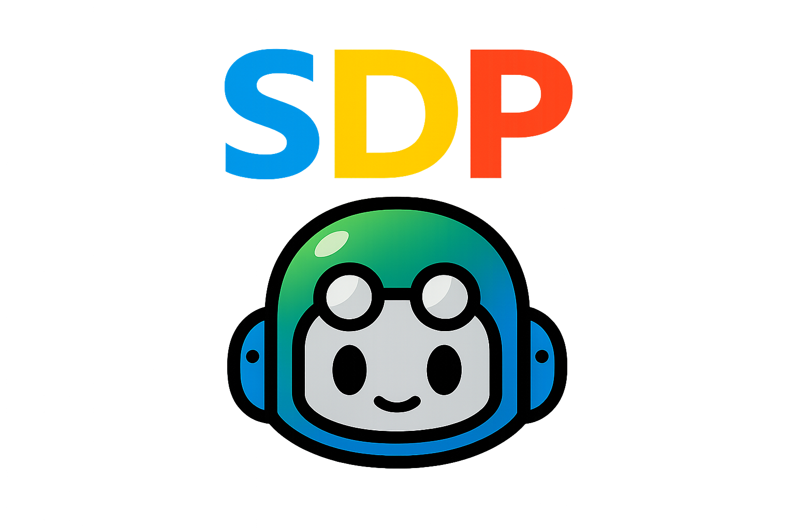

<div class="h-full flex flex-col items-center justify-center relative overflow-hidden">
  <!-- Gradient background -->
  <div class="absolute inset-0 bg-gradient-to-br from-violet-900/20 via-purple-900/10 to-fuchsia-900/20"></div>

  <!-- Glowing orb -->
  <div class="absolute top-1/4 left-1/2 -translate-x-1/2 -translate-y-1/2 w-96 h-96 bg-gradient-to-r from-violet-500/20 via-purple-500/20 to-fuchsia-500/20 rounded-full blur-3xl"></div>

  <!-- Logo with glow -->
  <div class="relative z-10">
    <div class="absolute inset-0 blur-2xl opacity-50">
      
    </div>
    
  </div>

  <!-- Gradient text title -->
  <h1 class="!text-5xl !font-bold !mt-8 bg-gradient-to-r from-violet-400 via-purple-400 to-fuchsia-400 bg-clip-text text-transparent relative z-10">
    GitHub Agentic Workflows
  </h1>

  <!-- Pill subtitle -->
  <div class="mt-4 relative z-10">
    <span class="px-6 py-2 bg-gradient-to-r from-violet-600/80 to-purple-600/80 rounded-full text-white text-xl font-medium shadow-lg shadow-violet-500/25">
      Repository Automation with AI Agents
    </span>
  </div>

  <!-- Tagline -->
  <div class="mt-8 text-lg opacity-70 relative z-10">
    ⏰ <strong>45-60 minutes</strong> • Developers • DevOps Engineers • Platform Teams
  </div>

  <!-- Decorative line -->
  <div class="mt-6 w-32 h-1 bg-gradient-to-r from-transparent via-violet-400 to-transparent rounded-full relative z-10"></div>
</div>

<div class="abs-br m-6 flex gap-2">
  <span class="text-sm opacity-50">Tech Talk · gh-aw</span>
</div>

---
layout: center
---

<div class="text-2xl font-bold mb-4">📖 Table of Contents</div>

<div class="grid grid-cols-3 gap-3">
  <div @click="$nav.go(3)" class="cursor-pointer p-3 bg-gradient-to-br from-violet-500/10 to-purple-500/10 rounded-lg border border-violet-500/20 hover:border-violet-500/50 hover:shadow-lg hover:shadow-violet-500/10 transition-all">
    <div class="text-2xl mb-1">🎯</div>
    <div class="text-sm font-semibold text-violet-300">The Opportunity</div>
    <div class="text-xs opacity-70">Intent-driven automation</div>
  </div>

  <div @click="$nav.go(5)" class="cursor-pointer p-3 bg-gradient-to-br from-purple-500/10 to-fuchsia-500/10 rounded-lg border border-purple-500/20 hover:border-purple-500/50 hover:shadow-lg hover:shadow-purple-500/10 transition-all">
    <div class="text-2xl mb-1">🔧</div>
    <div class="text-sm font-semibold text-purple-300">The Solution</div>
    <div class="text-xs opacity-70">Three core innovations</div>
  </div>

  <div @click="$nav.go(9)" class="cursor-pointer p-3 bg-gradient-to-br from-fuchsia-500/10 to-pink-500/10 rounded-lg border border-fuchsia-500/20 hover:border-fuchsia-500/50 hover:shadow-lg hover:shadow-fuchsia-500/10 transition-all">
    <div class="text-2xl mb-1">🏗️</div>
    <div class="text-sm font-semibold text-fuchsia-300">Architecture</div>
    <div class="text-xs opacity-70">How workflows execute</div>
  </div>

  <div @click="$nav.go(13)" class="cursor-pointer p-3 bg-gradient-to-br from-indigo-500/10 to-violet-500/10 rounded-lg border border-indigo-500/20 hover:border-indigo-500/50 hover:shadow-lg hover:shadow-indigo-500/10 transition-all">
    <div class="text-2xl mb-1">🛡️</div>
    <div class="text-sm font-semibold text-indigo-300">Safe Outputs</div>
    <div class="text-xs opacity-70">Security foundation</div>
  </div>

  <div @click="$nav.go(15)" class="cursor-pointer p-3 bg-gradient-to-br from-blue-500/10 to-indigo-500/10 rounded-lg border border-blue-500/20 hover:border-blue-500/50 hover:shadow-lg hover:shadow-blue-500/10 transition-all">
    <div class="text-2xl mb-1">🏭</div>
    <div class="text-sm font-semibold text-blue-300">Agent Factory</div>
    <div class="text-xs opacity-70">100+ workflow patterns</div>
  </div>

  <div @click="$nav.go(18)" class="cursor-pointer p-3 bg-gradient-to-br from-emerald-500/10 to-teal-500/10 rounded-lg border border-emerald-500/20 hover:border-emerald-500/50 hover:shadow-lg hover:shadow-emerald-500/10 transition-all">
    <div class="text-2xl mb-1">🚀</div>
    <div class="text-sm font-semibold text-emerald-300">Get Started</div>
    <div class="text-xs opacity-70">Your first workflow</div>
  </div>
</div>

---
layout: center
name: opportunity
---

<div class="text-center mb-6">
  <div class="text-5xl mb-4">🎯</div>
  <h1 class="!text-4xl bg-gradient-to-r from-violet-400 to-purple-400 bg-clip-text text-transparent">The Opportunity</h1>
  <p class="text-xl opacity-80 mt-2">Repository automation has entered a new era</p>
</div>

<div class="p-6 bg-gradient-to-r from-violet-500/10 to-purple-500/10 rounded-xl border border-violet-500/30 mb-6 text-center">
  <div class="text-2xl font-bold text-white">Write what you want to happen in Markdown</div>
  <div class="text-lg opacity-70 mt-1">AI figures out how</div>
</div>

<div class="grid grid-cols-4 gap-4">
  <div class="p-4 bg-violet-900/30 rounded-lg border border-violet-500/30 text-center">
    <div class="text-3xl mb-2">📝</div>
    <div class="font-semibold text-violet-300">Intent-Driven</div>
    <div class="text-xs opacity-70 mt-1">Describe outcomes, not steps</div>
  </div>

  <div class="p-4 bg-purple-900/30 rounded-lg border border-purple-500/30 text-center">
    <div class="text-3xl mb-2">🔒</div>
    <div class="font-semibold text-purple-300">Security-First</div>
    <div class="text-xs opacity-70 mt-1">Sandboxed agents, validated actions</div>
  </div>

  <div class="p-4 bg-fuchsia-900/30 rounded-lg border border-fuchsia-500/30 text-center">
    <div class="text-3xl mb-2">🧠</div>
    <div class="font-semibold text-fuchsia-300">Adaptive</div>
    <div class="text-xs opacity-70 mt-1">Context-aware decisions</div>
  </div>

  <div class="p-4 bg-indigo-900/30 rounded-lg border border-indigo-500/30 text-center">
    <div class="text-3xl mb-2">🔄</div>
    <div class="font-semibold text-indigo-300">Continuous</div>
    <div class="text-xs opacity-70 mt-1">Daily autonomous enhancements</div>
  </div>
</div>

---

# The Central Question

<div class="h-full flex items-center justify-center">
<div class="max-w-4xl">
<div class="text-6xl text-center mb-8">🤔</div>
<div class="text-3xl font-bold text-center bg-gradient-to-r from-violet-400 to-purple-400 bg-clip-text text-transparent mb-6 leading-snug">
"How can I automate repository tasks that require judgment and context—like triaging issues, reviewing code quality, or synthesizing progress reports—without writing complex YAML workflows?"
</div>
<div class="mt-8 flex gap-6 justify-center text-sm">
<div class="px-4 py-2 bg-violet-900/40 rounded-lg border border-violet-500/50 text-center">
<div class="font-bold text-violet-300">📝 Intent-Driven</div>
<div class="text-xs opacity-80 mt-1">Describe outcomes</div>
</div>
<div class="px-4 py-2 bg-purple-900/40 rounded-lg border border-purple-500/50 text-center">
<div class="font-bold text-purple-300">🤖 AI-Powered</div>
<div class="text-xs opacity-80 mt-1">Context-aware execution</div>
</div>
<div class="px-4 py-2 bg-fuchsia-900/40 rounded-lg border border-fuchsia-500/50 text-center">
<div class="font-bold text-fuchsia-300">🛡️ Secure</div>
<div class="text-xs opacity-80 mt-1">Sandboxed operations</div>
</div>
</div>
</div>
</div>

---
layout: center
name: solution
---

# 🔧 The Solution

## GitHub Agentic Workflows (gh-aw)

<div class="grid grid-cols-3 gap-4 mt-8">

<div class="p-4 bg-blue-500/10 rounded-lg border border-blue-500/30">
<div class="text-3xl mb-2">📝</div>
<div class="font-bold mb-2">Markdown Workflows</div>
<div class="text-sm opacity-80">Natural language instructions</div>
</div>

<div class="p-4 bg-green-500/10 rounded-lg border border-green-500/30">
<div class="text-3xl mb-2">🔒</div>
<div class="font-bold mb-2">Secure Compilation</div>
<div class="text-sm opacity-80">Markdown → YAML lock files</div>
</div>

<div class="p-4 bg-purple-500/10 rounded-lg border border-purple-500/30">
<div class="text-3xl mb-2">✅</div>
<div class="font-bold mb-2">Safe Outputs</div>
<div class="text-sm opacity-80">Pre-approved write operations</div>
</div>

</div>

---

# 1. Markdown-Based Workflows

Write automation as **natural language instructions**:

```markdown
---
on:
  schedule: daily
permissions:
  contents: read
  issues: read
safe-outputs:
  create-issue:
    title-prefix: "[daily-status] "
    labels: [report, automation]
---

## Daily Team Status Report

Create an upbeat daily status report summarizing:
- Recent activity (issues, PRs, discussions)
- Progress tracking and highlights
- Actionable next steps for maintainers
```

No explicit API calls, no complex conditionals—AI reads and executes.

---

# 2. Compilation to Secure Actions

`gh aw compile` converts Markdown → secure YAML:

<div class="grid grid-cols-2 gap-4 mt-4">

<div>

**Agent Job** (Read-Only)
- Isolated sandbox
- Read-only permissions
- Examines repository
- Produces JSON output

</div>

<div>

**Handler Jobs** (Minimal Write)
- Validates agent requests
- Sanitizes inputs
- Executes approved actions
- Audit logging

</div>

</div>

<div class="mt-6 p-4 bg-yellow-500/10 rounded border border-yellow-500/30">
<strong>Security:</strong> AI decides, sanitized handlers execute—separation of concerns
</div>

---

# 3. Safe Outputs: Pre-Approved Operations

Agents can't directly modify repositories. They request specific operations:

```yaml
safe-outputs:
  create-issue:
    title-prefix: "[ai] "
    labels: [automation]
    max: 5
    expires: 7  # auto-close after 7 days
```

<div class="mt-4 text-sm">

**Available Operations:**
- Issues: create, update, close, link sub-issues
- Pull Requests: create, push commits, request reviews
- Comments: add, hide
- Labels & Assignments: add/remove, assign, milestones
- Code Review: review comments, submit reviews
- Security: create/autofix code scanning alerts

</div>

---
layout: center
name: architecture
---

<div class="text-center mb-6">
  <div class="text-5xl mb-4">🏗️</div>
  <h1 class="!text-4xl bg-gradient-to-r from-fuchsia-400 to-pink-400 bg-clip-text text-transparent">Core Architecture</h1>
  <p class="text-xl opacity-80 mt-2">Three Execution Phases</p>
</div>

<div class="flex justify-center items-center gap-4">
  <div class="p-6 bg-gradient-to-br from-violet-500/20 to-purple-500/20 rounded-xl border border-violet-500/40 text-center w-48 hover:scale-105 transition-transform">
    <div class="text-5xl mb-3">✍️</div>
    <div class="text-lg font-bold text-violet-300">1. Authoring</div>
    <div class="text-sm opacity-70 mt-2">Write Markdown workflows</div>
    <div class="mt-3 text-xs bg-violet-500/20 px-2 py-1 rounded">.md files</div>
  </div>

  <div class="text-4xl text-fuchsia-400/60">→</div>

  <div class="p-6 bg-gradient-to-br from-fuchsia-500/20 to-pink-500/20 rounded-xl border border-fuchsia-500/40 text-center w-48 hover:scale-105 transition-transform">
    <div class="text-5xl mb-3">⚙️</div>
    <div class="text-lg font-bold text-fuchsia-300">2. Compilation</div>
    <div class="text-sm opacity-70 mt-2">Secure transformation</div>
    <div class="mt-3 text-xs bg-fuchsia-500/20 px-2 py-1 rounded">gh aw compile</div>
  </div>

  <div class="text-4xl text-pink-400/60">→</div>

  <div class="p-6 bg-gradient-to-br from-pink-500/20 to-rose-500/20 rounded-xl border border-pink-500/40 text-center w-48 hover:scale-105 transition-transform">
    <div class="text-5xl mb-3">🚀</div>
    <div class="text-lg font-bold text-pink-300">3. Execution</div>
    <div class="text-sm opacity-70 mt-2">Agent + Handlers</div>
    <div class="mt-3 text-xs bg-pink-500/20 px-2 py-1 rounded">.lock.yml</div>
  </div>
</div>

<div class="mt-8 p-4 bg-gradient-to-r from-violet-500/10 via-fuchsia-500/10 to-pink-500/10 rounded-lg border border-fuchsia-500/20 text-center max-w-2xl mx-auto">
  <span class="text-fuchsia-300 font-semibold">Security by Design:</span>
  <span class="opacity-80">AI reads and decides • Handlers validate and execute</span>
</div>

---

# Phase 1: Authoring

Create `.github/workflows/issue-triage.md`:

```markdown
---
on:
  issues:
    types: [opened]
permissions:
  contents: read
  issues: write
tools:
  github:
    toolsets: [issues, labels]
safe-outputs:
  add-labels:
    allowed: [bug, feature, docs]
    max: 3
---

## Issue Triage Workflow

Analyze new issues and apply appropriate labels.
```

**Components:** Triggers, permissions, tools, safe-outputs, instructions

---

# Phase 2: Compilation

Run `gh aw compile issue-triage`:

<div class="grid grid-cols-2 gap-4 mt-4">

<div class="text-sm">

1. Parse frontmatter
2. Extract Markdown body
3. Generate secure workflow:
   - Agent job (read-only)
   - Handler jobs (minimal write)
   - Permission isolation
   - Input sanitization

</div>

<div class="text-sm">

4. Write lock file:
   `.github/workflows/issue-triage.lock.yml`

**Properties:**
- Marked as generated
- Git merge strategy: `ours`
- Never manually edit
- Re-compile on source change

</div>

</div>

---

# Phase 3: Execution

When triggered, the workflow runs:

<div class="grid grid-cols-2 gap-4 mt-4">

<div class="p-4 bg-blue-500/10 rounded border border-blue-500/30">

**Agent Job**
1. Isolated container
2. Load AI agent
3. Provide tools & context
4. Agent explores repository
5. Produces JSON output

</div>

<div class="p-4 bg-green-500/10 rounded border border-green-500/30">

**Handler Jobs**
1. Receive agent output
2. Validate schema
3. Sanitize inputs
4. Verify permissions
5. Execute approved actions
6. Audit logging

</div>

</div>

<div class="mt-4 text-sm text-center opacity-70">
Agent has zero write access • Only validated operations execute
</div>

---
layout: center
name: safe-outputs
---

<div class="text-center mb-6">
  <div class="text-5xl mb-4">🛡️</div>
  <h1 class="!text-4xl bg-gradient-to-r from-indigo-400 to-violet-400 bg-clip-text text-transparent">Safe Outputs Deep Dive</h1>
  <p class="text-xl opacity-80 mt-2">Security Through Separation of Concerns</p>
</div>

<div class="p-5 bg-gradient-to-r from-indigo-500/10 to-violet-500/10 rounded-xl border border-indigo-500/30 mb-6 text-center max-w-3xl mx-auto">
  <div class="text-lg opacity-80 mb-2">How do we let AI agents automate tasks without risking unauthorized modifications?</div>
</div>

<div class="flex justify-center gap-6 mb-6">
  <div class="p-4 bg-blue-900/30 rounded-lg border border-blue-500/40 text-center w-56">
    <div class="text-3xl mb-2">🔍</div>
    <div class="font-bold text-blue-300">Read-Only AI</div>
    <div class="text-xs opacity-70 mt-1">Analyzes and decides</div>
  </div>

  <div class="text-3xl text-indigo-400/60 self-center">→</div>

  <div class="p-4 bg-indigo-900/30 rounded-lg border border-indigo-500/40 text-center w-56">
    <div class="text-3xl mb-2">📋</div>
    <div class="font-bold text-indigo-300">Structured Request</div>
    <div class="text-xs opacity-70 mt-1">JSON output schema</div>
  </div>

  <div class="text-3xl text-violet-400/60 self-center">→</div>

  <div class="p-4 bg-violet-900/30 rounded-lg border border-violet-500/40 text-center w-56">
    <div class="text-3xl mb-2">✅</div>
    <div class="font-bold text-violet-300">Validated Handler</div>
    <div class="text-xs opacity-70 mt-1">Executes approved actions</div>
  </div>
</div>

<div class="p-3 bg-green-500/10 rounded-lg border border-green-500/30 text-center max-w-2xl mx-auto">
  <span class="text-green-400 font-semibold">Result:</span>
  <span class="opacity-80">AI never has write tokens • All mutations audited and rate-limited</span>
</div>

---

# The Safe Output Lifecycle

<div class="text-sm">

**1. Declaration** (Workflow Frontmatter)
```yaml
safe-outputs:
  create-issue:
    title-prefix: "[bot] "
    labels: [automation]
    max: 5
    expires: 7
```

**2. Agent Request** (Structured JSON)
```json
{
  "type": "create_issue",
  "title": "[bot] CI failure in test-auth.js",
  "body": "## Failure Summary\n\nTest suite failed...",
  "labels": ["automation", "ci-failure"]
}
```

</div>

---
layout: center
name: agent-factory
---

<div class="text-center mb-4">
  <div class="text-5xl mb-3">🏭</div>
  <h1 class="!text-4xl bg-gradient-to-r from-blue-400 to-indigo-400 bg-clip-text text-transparent">The Agent Factory Pattern</h1>
  <p class="text-lg opacity-80 mt-2">Discovering Repository Automation Patterns</p>
</div>

<div class="p-5 bg-gradient-to-r from-blue-500/10 to-indigo-500/10 rounded-xl border border-blue-500/30 mb-5 text-center max-w-3xl mx-auto">
  <div class="text-lg">GitHub Next built <span class="text-3xl font-bold text-blue-400">100+</span> specialized workflows</div>
  <div class="text-sm opacity-70 mt-1">Running continuously in real development environments</div>
</div>

<div class="grid grid-cols-2 gap-4">
  <div class="p-4 bg-gradient-to-br from-purple-500/15 to-violet-500/15 rounded-lg border border-purple-500/30">
    <div class="flex items-center gap-2 mb-2">
      <span class="text-2xl">🎯</span>
      <span class="font-bold text-purple-300">Philosophy</span>
    </div>
    <div class="text-sm opacity-80">Create many specialized workflows, use them continuously, observe what works, share the knowledge</div>
  </div>

  <div class="p-4 bg-gradient-to-br from-blue-500/15 to-cyan-500/15 rounded-lg border border-blue-500/30">
    <div class="flex items-center gap-2 mb-2">
      <span class="text-2xl">💡</span>
      <span class="font-bold text-blue-300">Key Insight</span>
    </div>
    <div class="text-sm opacity-80">Don't build one monolithic agent—build many focused workflows that each excel at a specific task</div>
  </div>
</div>

<div class="mt-4 text-center text-sm opacity-60">
  Specialized > Generalized • Observable > Opaque • Composable > Monolithic
</div>

---

# Factory Categories

| Category | Example Workflows |
|----------|-------------------|
| **Continuous Improvement** | Simplify code, refactor patterns, update dependencies |
| **Issue & PR Management** | Auto-label issues, link PRs, track sub-issues |
| **Metrics & Analytics** | Daily/weekly reports, trend analysis, contributor stats |
| **Quality & Testing** | CI failure diagnosis, flaky test detection |
| **Security & Compliance** | Code scanning triage, dependency audits |
| **Multi-Repository** | Feature sync, multi-repo tracking |
| **Meta-Workflows** | Workflow health monitoring, performance analysis |

---

# Proven Patterns

<div class="grid grid-cols-2 gap-4">

  <div class="p-4 bg-gradient-to-br from-emerald-500/15 to-teal-500/15 rounded-lg border border-emerald-500/30">
    <div class="flex items-center gap-2 mb-2">
      <span class="text-2xl">🔄</span>
      <span class="font-bold text-emerald-300">Continuous Simplicity</span>
    </div>
    <div class="grid grid-cols-2 gap-2 text-xs">
      <div class="bg-emerald-500/10 px-2 py-1 rounded">⏰ Daily schedule</div>
      <div class="bg-emerald-500/10 px-2 py-1 rounded">🔍 Scan for simplifications</div>
      <div class="bg-emerald-500/10 px-2 py-1 rounded">📤 PR with suggestions</div>
      <div class="bg-emerald-500/10 px-2 py-1 rounded">📈 Compounds over time</div>
    </div>
  </div>

  <div class="p-4 bg-gradient-to-br from-blue-500/15 to-indigo-500/15 rounded-lg border border-blue-500/30">
    <div class="flex items-center gap-2 mb-2">
      <span class="text-2xl">🎭</span>
      <span class="font-bold text-blue-300">Meta-Workflows</span>
    </div>
    <div class="grid grid-cols-2 gap-2 text-xs">
      <div class="bg-blue-500/10 px-2 py-1 rounded">👀 Monitor workflows</div>
      <div class="bg-blue-500/10 px-2 py-1 rounded">📊 Analyze execution</div>
      <div class="bg-blue-500/10 px-2 py-1 rounded">💡 Suggest improvements</div>
      <div class="bg-blue-500/10 px-2 py-1 rounded">🔧 Self-optimizing</div>
    </div>
  </div>

  <div class="p-4 bg-gradient-to-br from-purple-500/15 to-violet-500/15 rounded-lg border border-purple-500/30">
    <div class="flex items-center gap-2 mb-2">
      <span class="text-2xl">🎯</span>
      <span class="font-bold text-purple-300">Orchestrator-Worker</span>
    </div>
    <div class="grid grid-cols-2 gap-2 text-xs">
      <div class="bg-purple-500/10 px-2 py-1 rounded">📋 Dispatch workers</div>
      <div class="bg-purple-500/10 px-2 py-1 rounded">⚙️ Specialized tasks</div>
      <div class="bg-purple-500/10 px-2 py-1 rounded">🧩 Synthesize results</div>
      <div class="bg-purple-500/10 px-2 py-1 rounded">📅 Multi-phase work</div>
    </div>
  </div>

  <div class="p-4 bg-gradient-to-br from-orange-500/15 to-amber-500/15 rounded-lg border border-orange-500/30">
    <div class="flex items-center gap-2 mb-2">
      <span class="text-2xl">📋</span>
      <span class="font-bold text-orange-300">Issue Group Management</span>
    </div>
    <div class="grid grid-cols-2 gap-2 text-xs">
      <div class="bg-orange-500/10 px-2 py-1 rounded">🎫 Parent + sub-issues</div>
      <div class="bg-orange-500/10 px-2 py-1 rounded">✅ Track completion</div>
      <div class="bg-orange-500/10 px-2 py-1 rounded">📈 Auto-update progress</div>
      <div class="bg-orange-500/10 px-2 py-1 rounded">🤝 Zero-effort coord</div>
    </div>
  </div>

</div>

---
layout: center
name: get-started
---

# 🚀 What You Can Do Today

## Get Started in 15 Minutes

<div class="grid grid-cols-3 gap-4 mt-8 text-sm">

<div class="p-4 bg-gradient-to-br from-blue-500/10 to-purple-500/10 rounded-lg border border-blue-500/20">
<div class="text-3xl mb-2">1️⃣</div>
<div class="font-bold mb-2">Install</div>
<div class="opacity-80">gh CLI extension</div>
</div>

<div class="p-4 bg-gradient-to-br from-green-500/10 to-blue-500/10 rounded-lg border border-green-500/20">
<div class="text-3xl mb-2">2️⃣</div>
<div class="font-bold mb-2">Create</div>
<div class="opacity-80">First workflow</div>
</div>

<div class="p-4 bg-gradient-to-br from-purple-500/10 to-pink-500/10 rounded-lg border border-purple-500/20">
<div class="text-3xl mb-2">3️⃣</div>
<div class="font-bold mb-2">Deploy</div>
<div class="opacity-80">Compile & push</div>
</div>

</div>

---

# Install & Create

```bash
# Install gh-aw CLI extension
curl -sL https://raw.githubusercontent.com/github/gh-aw/main/install-gh-aw.sh | bash
gh aw version

# Create your first workflow
gh aw new daily-status-report

# Edit the workflow
# .github/workflows/daily-status-report.md
```

Key steps:
1. Add natural language instructions in Markdown body
2. Configure `safe-outputs` in frontmatter
3. Set trigger to `on: schedule: daily`

---

# Compile & Deploy

```bash
# Compile Markdown → YAML lock file
gh aw compile daily-status-report

# Commit both files
git add .github/workflows/daily-status-report.md \
        .github/workflows/daily-status-report.lock.yml

git commit -m "Add daily status report workflow"
git push
```

<div class="mt-6 p-4 bg-green-500/10 rounded border border-green-500/30">
✅ Your workflow is now live—running on schedule with built-in security
</div>

---

# 🧠 Mental Model Shift

<div class="grid grid-cols-2 gap-6 mt-6">

<div class="p-6 bg-red-500/10 rounded-lg border border-red-500/30">

### ❌ Old Model

**Prescriptive Automation**

- Write exact steps in YAML
- Account for every branch
- Update on every change
- Deterministic execution

</div>

<div class="p-6 bg-green-500/10 rounded-lg border border-green-500/30">

### ✨ New Model

**Intent-Driven Automation**

- Describe desired outcome
- AI adapts to context
- Learns from repository
- Context-sensitive execution

</div>

</div>

---

# ✅ Patterns Worth Exploring

<div class="grid grid-cols-2 gap-4">

  <div class="p-4 bg-gradient-to-br from-emerald-500/15 to-green-500/15 rounded-lg border border-emerald-500/30">
    <div class="flex items-center gap-2 mb-3">
      <span class="text-2xl">📝</span>
      <span class="font-bold text-emerald-300">Intent-Driven Design</span>
    </div>
    <div class="space-y-1 text-sm">
      <div class="flex items-center gap-2"><span class="text-emerald-400">✓</span> Natural language instructions</div>
      <div class="flex items-center gap-2"><span class="text-emerald-400">✓</span> Context-aware decisions</div>
      <div class="flex items-center gap-2"><span class="text-emerald-400">✓</span> Read-only by default</div>
    </div>
  </div>

  <div class="p-4 bg-gradient-to-br from-teal-500/15 to-cyan-500/15 rounded-lg border border-teal-500/30">
    <div class="flex items-center gap-2 mb-3">
      <span class="text-2xl">🛡️</span>
      <span class="font-bold text-teal-300">Security-First</span>
    </div>
    <div class="space-y-1 text-sm">
      <div class="flex items-center gap-2"><span class="text-teal-400">✓</span> Safe-output validation</div>
      <div class="flex items-center gap-2"><span class="text-teal-400">✓</span> Human-in-the-loop gates</div>
      <div class="flex items-center gap-2"><span class="text-teal-400">✓</span> Sandboxed execution</div>
    </div>
  </div>

  <div class="p-4 bg-gradient-to-br from-blue-500/15 to-indigo-500/15 rounded-lg border border-blue-500/30">
    <div class="flex items-center gap-2 mb-3">
      <span class="text-2xl">🏭</span>
      <span class="font-bold text-blue-300">Factory Mindset</span>
    </div>
    <div class="space-y-1 text-sm">
      <div class="flex items-center gap-2"><span class="text-blue-400">✓</span> Specialized workflows</div>
      <div class="flex items-center gap-2"><span class="text-blue-400">✓</span> Meta-workflows</div>
      <div class="flex items-center gap-2"><span class="text-blue-400">✓</span> Compounding value</div>
    </div>
  </div>

  <div class="p-4 bg-gradient-to-br from-amber-500/15 to-orange-500/15 rounded-lg border border-amber-500/30">
    <div class="flex items-center gap-2 mb-3">
      <span class="text-2xl">🛑</span>
      <span class="font-bold text-amber-300">Boundaries to Know</span>
    </div>
    <div class="space-y-1 text-sm">
      <div class="flex items-center gap-2"><span class="text-amber-400">⚠</span> No direct write access (injection risk)</div>
      <div class="flex items-center gap-2"><span class="text-amber-400">⚠</span> Always handle noop pattern</div>
      <div class="flex items-center gap-2"><span class="text-amber-400">⚠</span> Never edit lock files manually</div>
    </div>
  </div>

</div>

---

# Key Concepts to Master

| Concept | Why It Matters |
|---------|----------------|
| **Safe Outputs** | Security foundation—validation pipeline |
| **Noop Pattern** | Prevent #1 failure mode—handle "no action" case |
| **Compilation** | Markdown → secure YAML—verify lock files |
| **Agent Factory** | Specialization > monolithic—many focused workflows |
| **Human-in-the-Loop** | Draft PRs, expirations, review gates |

---
layout: center
---

<div class="text-center mb-6">
  <div class="text-5xl mb-3">💡</div>
  <h1 class="!text-4xl bg-gradient-to-r from-amber-400 to-yellow-400 bg-clip-text text-transparent">Key Takeaways</h1>
</div>

<div class="space-y-3 max-w-3xl mx-auto">

  <div class="flex items-center gap-4 p-3 bg-gradient-to-r from-violet-500/10 to-purple-500/10 rounded-lg border border-violet-500/20">
    <span class="text-2xl">📝</span>
    <div><span class="font-semibold text-violet-300">Write workflows in natural language</span> <span class="opacity-70">— Markdown instead of YAML</span></div>
  </div>

  <div class="flex items-center gap-4 p-3 bg-gradient-to-r from-blue-500/10 to-indigo-500/10 rounded-lg border border-blue-500/20">
    <span class="text-2xl">🧠</span>
    <div><span class="font-semibold text-blue-300">AI agents make context-aware decisions</span> <span class="opacity-70">— adapting to repository state</span></div>
  </div>

  <div class="flex items-center gap-4 p-3 bg-gradient-to-r from-emerald-500/10 to-teal-500/10 rounded-lg border border-emerald-500/20">
    <span class="text-2xl">🛡️</span>
    <div><span class="font-semibold text-emerald-300">Security-first design</span> <span class="opacity-70">— separates decision-making from execution</span></div>
  </div>

  <div class="flex items-center gap-4 p-3 bg-gradient-to-r from-fuchsia-500/10 to-pink-500/10 rounded-lg border border-fuchsia-500/20">
    <span class="text-2xl">🏭</span>
    <div><span class="font-semibold text-fuchsia-300">Specialization reveals possibilities</span> <span class="opacity-70">— build many focused agents</span></div>
  </div>

  <div class="flex items-center gap-4 p-3 bg-gradient-to-r from-amber-500/10 to-orange-500/10 rounded-lg border border-amber-500/20">
    <span class="text-2xl">📈</span>
    <div><span class="font-semibold text-amber-300">Continuous improvement compounds</span> <span class="opacity-70">— daily autonomous enhancements</span></div>
  </div>

</div>

---
layout: center
---

<div class="text-center mb-8">
  <div class="text-6xl mb-6">🎯</div>
  <h1 class="!text-5xl bg-gradient-to-r from-violet-400 via-purple-400 to-fuchsia-400 bg-clip-text text-transparent">The Shift</h1>
</div>

<div class="p-8 bg-gradient-to-br from-violet-500/10 via-purple-500/10 to-fuchsia-500/10 rounded-2xl border border-purple-500/30 max-w-3xl mx-auto text-center">
  <div class="opacity-60 mb-4">From</div>
  <div class="text-2xl font-bold text-gray-400 mb-6">scripting what to do step-by-step</div>
  <div class="w-16 h-1 bg-gradient-to-r from-violet-400 via-purple-400 to-fuchsia-400 rounded-full mx-auto my-4"></div>
  <div class="opacity-60 mb-4">To</div>
  <div class="text-2xl font-bold text-purple-300">declaring what success looks like</div>
  <div class="text-lg opacity-70 mt-4">and letting AI navigate the path</div>
</div>

---
layout: center
---

<div class="text-center mb-6">
  <div class="text-5xl mb-4">🙏</div>
  <h1 class="!text-4xl bg-gradient-to-r from-violet-400 via-purple-400 to-fuchsia-400 bg-clip-text text-transparent">Thank You</h1>
  <p class="text-xl opacity-80 mt-2">GitHub Agentic Workflows • Repository Automation with AI Agents</p>
</div>

<div class="grid grid-cols-2 gap-3 max-w-4xl mx-auto text-sm">
  <a href="https://github.github.com/gh-aw/" target="_blank" class="p-3 bg-violet-500/10 rounded-lg border border-violet-500/20 hover:border-violet-500/50 transition-all no-underline">
    <div class="font-semibold text-violet-300">📚 Official Documentation</div>
    <div class="text-xs opacity-60 mt-1">github.github.com/gh-aw</div>
  </a>

  <a href="https://github.github.io/gh-aw/reference/safe-outputs/" target="_blank" class="p-3 bg-purple-500/10 rounded-lg border border-purple-500/20 hover:border-purple-500/50 transition-all no-underline">
    <div class="font-semibold text-purple-300">🛡️ Safe Outputs Reference</div>
    <div class="text-xs opacity-60 mt-1">Complete output types & validation</div>
  </a>

  <a href="https://github.github.com/gh-aw/blog/2026-01-12-welcome-to-pelis-agent-factory/" target="_blank" class="p-3 bg-fuchsia-500/10 rounded-lg border border-fuchsia-500/20 hover:border-fuchsia-500/50 transition-all no-underline">
    <div class="font-semibold text-fuchsia-300">🏭 Agent Factory Blog</div>
    <div class="text-xs opacity-60 mt-1">100+ workflow patterns</div>
  </a>

  <a href="https://github.com/Sentry01/AgentCouncil" target="_blank" class="p-3 bg-indigo-500/10 rounded-lg border border-indigo-500/20 hover:border-indigo-500/50 transition-all no-underline">
    <div class="font-semibold text-indigo-300">🤝 AgentCouncil</div>
    <div class="text-xs opacity-60 mt-1">Multi-agent collaboration patterns</div>
  </a>
</div>

<div class="mt-6 text-center text-sm opacity-50">
  Built from official docs, Peli's Agent Factory research, and community tutorials
</div>
