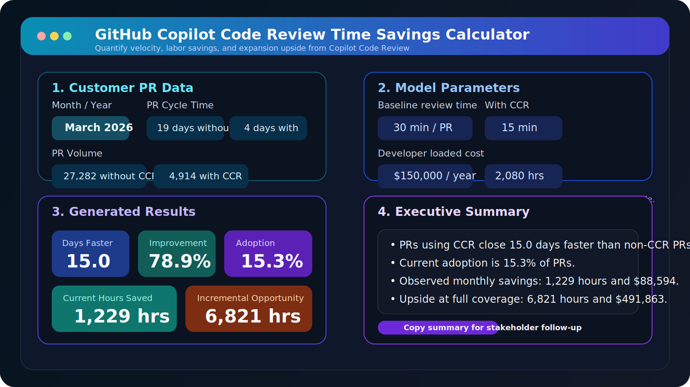
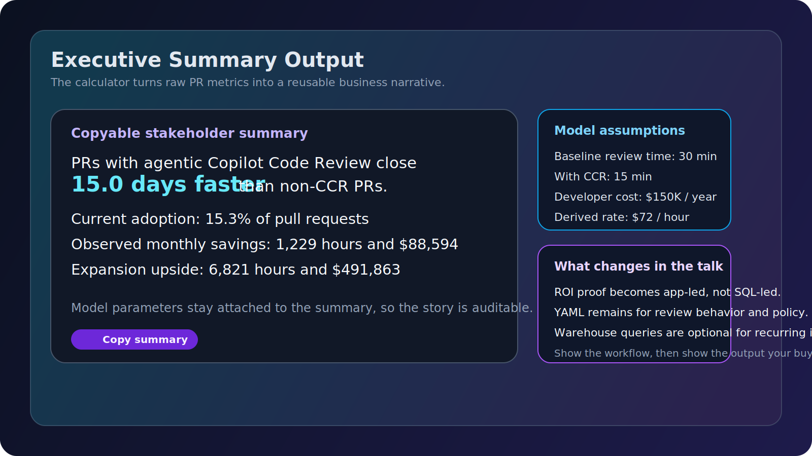

<div class="h-full flex flex-col items-center justify-center relative overflow-hidden">
<div class="absolute inset-0 bg-gradient-to-br from-cyan-900/20 via-blue-900/10 to-indigo-900/20"></div>
<div class="absolute top-1/4 left-1/2 -translate-x-1/2 -translate-y-1/2 w-96 h-96 bg-gradient-to-r from-cyan-500/20 via-blue-500/20 to-indigo-500/20 rounded-full blur-3xl"></div>
<div class="relative z-10">
<div class="absolute inset-0 blur-2xl opacity-50">

</div>

</div>
<h1 class="!text-5xl !font-bold !mt-8 bg-gradient-to-r from-cyan-400 via-blue-400 to-indigo-400 bg-clip-text text-transparent relative z-10">
Copilot Code Review
</h1>
<div class="mt-4 relative z-10">
<span class="px-6 py-2 bg-gradient-to-r from-cyan-600/80 to-blue-600/80 rounded-full text-white text-xl font-medium shadow-lg shadow-cyan-500/25">
Accelerating PR Velocity & Maximizing ROI
</span>
</div>
<div class="mt-8 text-lg opacity-70 relative z-10">
⏰ <strong>30-40 minutes</strong> · Developers · DevOps Teams · Engineering Managers
</div>
<div class="mt-6 w-32 h-1 bg-gradient-to-r from-transparent via-cyan-400 to-transparent rounded-full relative z-10"></div>
</div>

---

# The Central Question

<div class="max-w-5xl mx-auto mt-3">
<div class="p-6 bg-gradient-to-br from-cyan-900/30 via-blue-900/20 to-indigo-900/30 rounded-2xl border-2 border-cyan-500/40 shadow-2xl shadow-cyan-900/20 relative overflow-hidden">
<div class="absolute -top-12 right-10 w-40 h-40 rounded-full bg-cyan-400/10 blur-3xl"></div>
<div class="absolute -bottom-12 left-12 w-48 h-48 rounded-full bg-indigo-400/10 blur-3xl"></div>
<div class="relative z-10">
<div class="text-5xl text-center mb-4">🤔</div>
<div class="text-[10px] uppercase tracking-[0.35em] text-cyan-300/80 text-center mb-3">The Executive Framing</div>
<div class="text-3xl leading-tight font-bold text-center bg-gradient-to-r from-cyan-300 via-blue-300 to-indigo-300 bg-clip-text text-transparent mb-4">
"How can Copilot Code Review cut PR review time by 40-60% while making the business case obvious?"
</div>
<div class="max-w-3xl mx-auto text-base text-center text-gray-200/90">
PRs sit open for days, senior reviewers become the throughput constraint, and leadership still expects proof that faster review does not mean weaker quality.
</div>
</div>
</div>

<div class="grid grid-cols-3 gap-3 mt-4 text-sm">
<div class="p-3 bg-red-900/20 rounded-xl border border-red-500/30">
<div class="text-red-300 font-semibold mb-2">The Friction</div>
<div class="text-xl font-bold text-white">Days of Delay</div>
<div class="text-gray-300 mt-1 text-xs">PRs wait on scarce reviewer time, context switching, and inconsistent standards.</div>
</div>
<div class="p-3 bg-cyan-900/20 rounded-xl border border-cyan-500/30">
<div class="text-cyan-300 font-semibold mb-2">The Shift</div>
<div class="text-xl font-bold text-white">Review as Feedback</div>
<div class="text-gray-300 mt-1 text-xs">Copilot handles the mechanical review load so humans can focus on intent, risk, and exceptions.</div>
</div>
<div class="p-3 bg-indigo-900/20 rounded-xl border border-indigo-500/30">
<div class="text-indigo-300 font-semibold mb-2">The Proof</div>
<div class="text-xl font-bold text-white">ROI You Can Reuse</div>
<div class="text-gray-300 mt-1 text-xs">The calculator turns PR analytics and assumptions into a stakeholder-ready value story.</div>
</div>
</div>

</div>

---
layout: center
---

# 📖 Navigate by Section

<div class="grid grid-cols-2 gap-6 mt-8">
<div @click="$nav.go(5)" class="cursor-pointer p-6 bg-cyan-900/40 rounded-lg border-2 border-cyan-500 hover:bg-cyan-900/60 transition-all">
<div class="text-2xl mb-2">⚙️</div>
<div class="text-lg font-bold text-cyan-300">Setup & Configuration</div>
<div class="text-sm text-gray-300 mt-1">From zero to first review in 15 min</div>
<div class="text-xs text-gray-400 mt-2">YAML config + status checks</div>
</div>
<div @click="$nav.go(8)" class="cursor-pointer p-6 bg-blue-900/40 rounded-lg border-2 border-blue-500 hover:bg-blue-900/60 transition-all">
<div class="text-2xl mb-2">🔒</div>
<div class="text-lg font-bold text-blue-300">Compliance & Security</div>
<div class="text-sm text-gray-300 mt-1">Custom rulesets for HIPAA, PCI, SOC2</div>
<div class="text-xs text-gray-400 mt-2">Automated audit trails</div>
</div>
<div @click="$nav.go(11)" class="cursor-pointer p-6 bg-indigo-900/40 rounded-lg border-2 border-indigo-500 hover:bg-indigo-900/60 transition-all">
<div class="text-2xl mb-2">📊</div>
<div class="text-lg font-bold text-indigo-300">ROI Calculator</div>
<div class="text-sm text-gray-300 mt-1">Turn PR analytics into an executive-ready savings story</div>
<div class="text-xs text-gray-400 mt-2">Cycle time, labor savings, and upside</div>
</div>
<div @click="$nav.go(14)" class="cursor-pointer p-6 bg-purple-900/40 rounded-lg border-2 border-purple-500 hover:bg-purple-900/60 transition-all">
<div class="text-2xl mb-2">🚀</div>
<div class="text-lg font-bold text-purple-300">Team Adoption</div>
<div class="text-sm text-gray-300 mt-1">Phased rollout and best practices</div>
<div class="text-xs text-gray-400 mt-2">Avoid alert fatigue pitfalls</div>
</div>
</div>

<div class="mt-8 p-4 bg-gradient-to-r from-cyan-900/30 to-purple-900/30 rounded-lg text-center">
<span class="text-white font-bold">💡 Click any section to jump directly there</span>
</div>

---

# ❌ The Problem: PR Review Bottleneck

<div class="grid grid-cols-2 gap-6 mt-6">
<div class="p-4 bg-red-900/30 rounded-lg border-l-4 border-red-500">
<div class="text-lg font-bold text-red-300 mb-3">⏳ Capacity Crunch</div>
<div class="text-sm text-gray-300 space-y-2">
<div>• 50-100+ PRs/week with 2-3 senior reviewers</div>
<div>• Average <strong>3.2 days</strong> to merge</div>
<div>• 30% of senior dev time spent reviewing</div>
</div>
</div>
<div class="p-4 bg-red-900/30 rounded-lg border-l-4 border-red-500">
<div class="text-lg font-bold text-red-300 mb-3">💸 Hidden Costs</div>
<div class="text-sm text-gray-300 space-y-2">
<div>• 15-20 min context-switch per PR</div>
<div>• Security issues missed 40-60% under pressure</div>
<div>• New devs wait 6-8 weeks to learn standards</div>
</div>
</div>
</div>

<div class="mt-6 p-4 bg-gradient-to-r from-red-900/40 to-gray-800 rounded-lg text-center">
<span class="text-white font-bold">⚠️ Organizations face a painful choice: sacrifice speed for quality, or ship fast and accept risk</span>
</div>

---
layout: center
name: setup
---

# ⚙️ Setup & Configuration

<div class="max-w-4xl mx-auto mt-6">
<div class="p-8 bg-gradient-to-br from-cyan-900/30 via-blue-900/20 to-indigo-900/30 rounded-2xl border-2 border-cyan-500/40 shadow-2xl shadow-cyan-900/20 relative overflow-hidden">
<div class="absolute -top-12 right-8 w-40 h-40 rounded-full bg-cyan-400/10 blur-3xl"></div>
<div class="absolute -bottom-12 left-10 w-44 h-44 rounded-full bg-blue-400/10 blur-3xl"></div>
<div class="relative z-10">
<div class="text-[10px] uppercase tracking-[0.35em] text-cyan-300/80 mb-3">Section 1 of 4</div>
<div class="text-5xl font-bold bg-gradient-to-r from-cyan-300 via-blue-300 to-indigo-300 bg-clip-text text-transparent leading-tight">
From Zero to First Review
</div>
<div class="mt-4 text-xl text-gray-200/90 max-w-3xl mx-auto">
Turn Copilot review on fast, choose the right activation path, and grow toward enforceable quality gates.
</div>
</div>
</div>

<div class="grid grid-cols-3 gap-4 mt-5 text-center text-sm">
<div class="p-4 bg-cyan-900/25 rounded-xl border border-cyan-500/30">
<div class="text-cyan-300 font-semibold">Manual</div>
<div class="text-xs text-gray-300 mt-1">Start with a single PR</div>
</div>
<div class="p-4 bg-blue-900/25 rounded-xl border border-blue-500/30">
<div class="text-blue-300 font-semibold">Repository Ruleset</div>
<div class="text-xs text-gray-300 mt-1">Automate for one team</div>
</div>
<div class="p-4 bg-indigo-900/25 rounded-xl border border-indigo-500/30">
<div class="text-indigo-300 font-semibold">Required Checks</div>
<div class="text-xs text-gray-300 mt-1">Enforce trusted feedback</div>
</div>
</div>

<div class="mt-5 p-3 bg-gradient-to-r from-cyan-600/80 to-blue-600/80 rounded-xl text-center shadow-lg shadow-cyan-900/20">
<span class="text-white font-bold text-sm">Start simple, then add automation and enforcement once the team trusts the signal.</span>
</div>
</div>

---

# ⚙️ Quick Start: 3 Ways to Activate

<div class="grid grid-cols-3 gap-4 mt-6">
<div class="p-4 bg-cyan-900/40 rounded-lg border-2 border-cyan-500">
<div class="text-2xl mb-2">👤</div>
<div class="text-sm font-bold text-cyan-300">Manual Request</div>
<div class="text-xs text-gray-300 mt-2 space-y-1">
<div>• Open any PR on GitHub</div>
<div>• Select <strong>Copilot</strong> from Reviewers</div>
<div>• Review arrives in ~30 seconds</div>
</div>
</div>
<div class="p-4 bg-blue-900/40 rounded-lg border-2 border-blue-500">
<div class="text-2xl mb-2">📋</div>
<div class="text-sm font-bold text-blue-300">Repo Ruleset</div>
<div class="text-xs text-gray-300 mt-2 space-y-1">
<div>• Settings → Rules → Rulesets</div>
<div>• New branch ruleset</div>
<div>• Enable "Auto request Copilot review"</div>
</div>
</div>
<div class="p-4 bg-indigo-900/40 rounded-lg border-2 border-indigo-500">
<div class="text-2xl mb-2">🏢</div>
<div class="text-sm font-bold text-indigo-300">Org-Wide Ruleset</div>
<div class="text-xs text-gray-300 mt-2 space-y-1">
<div>• Org Settings → Repository → Rulesets</div>
<div>• Target repos by name pattern</div>
<div>• Enforces across all matching repos</div>
</div>
</div>
</div>

<div class="mt-4 p-3 bg-gradient-to-r from-cyan-900/30 to-indigo-900/30 rounded-lg text-center">
<span class="text-white text-sm">📖 <a href="https://docs.github.com/en/copilot/how-tos/use-copilot-agents/request-a-code-review/configure-automatic-review" class="text-cyan-300 underline">Configure automatic review docs</a> · Customize via <code>.github/copilot-instructions.md</code></span>
</div>

---

# 🏗️ Architecture: How It Works

<div class="flex flex-col items-center gap-3 mt-4">
<div class="p-3 bg-cyan-900/40 rounded-lg border-2 border-cyan-500 w-80 text-center">
<div class="text-sm font-bold text-cyan-300">PR Event (create / update / @mention)</div>
</div>
<div class="text-2xl text-gray-400">↓</div>
<div class="grid grid-cols-3 gap-3 w-full">
<div class="p-3 bg-blue-900/40 rounded-lg border border-blue-500 text-center">
<div class="text-xs font-bold text-blue-300">🔍 Static Analysis</div>
<div class="text-xs text-gray-400 mt-1">Linting, patterns</div>
</div>
<div class="p-3 bg-indigo-900/40 rounded-lg border border-indigo-500 text-center">
<div class="text-xs font-bold text-indigo-300">🌳 AST Parsing</div>
<div class="text-xs text-gray-400 mt-1">Structural issues</div>
</div>
<div class="p-3 bg-purple-900/40 rounded-lg border border-purple-500 text-center">
<div class="text-xs font-bold text-purple-300">🧠 LLM Semantic</div>
<div class="text-xs text-gray-400 mt-1">Contextual understanding</div>
</div>
</div>
<div class="text-2xl text-gray-400">↓</div>
<div class="p-3 bg-green-900/40 rounded-lg border-2 border-green-500 w-96 text-center">
<div class="text-sm font-bold text-green-300">Inline PR Comments · Categorized by Severity</div>
</div>
</div>

<div class="mt-4 p-3 bg-gradient-to-r from-cyan-600/80 to-blue-600/80 rounded-lg text-center">
<span class="text-white font-bold text-sm">Full repo context: commit history, file relationships, test suites</span>
</div>

---
layout: center
name: compliance
---

# 🔒 Compliance & Security

<div class="max-w-4xl mx-auto mt-6">
<div class="p-8 bg-gradient-to-br from-blue-900/30 via-indigo-900/20 to-slate-900/30 rounded-2xl border-2 border-blue-500/40 shadow-2xl shadow-indigo-900/20 relative overflow-hidden">
<div class="absolute -top-12 right-8 w-40 h-40 rounded-full bg-blue-400/10 blur-3xl"></div>
<div class="absolute -bottom-12 left-10 w-44 h-44 rounded-full bg-indigo-400/10 blur-3xl"></div>
<div class="relative z-10">
<div class="text-[10px] uppercase tracking-[0.35em] text-blue-300/80 mb-3">Section 2 of 4</div>
<div class="text-5xl font-bold bg-gradient-to-r from-blue-300 via-indigo-300 to-slate-200 bg-clip-text text-transparent leading-tight">
Custom Rulesets for Your Organization
</div>
<div class="mt-4 text-xl text-gray-200/90 max-w-3xl mx-auto">
Move from generic review to policy-aware enforcement for security, compliance, and organization-specific standards.
</div>
</div>
</div>

<div class="grid grid-cols-4 gap-3 mt-5 text-center text-sm">
<div class="p-3 bg-blue-900/25 rounded-xl border border-blue-500/30">
<div class="text-blue-300 font-semibold">HIPAA</div>
</div>
<div class="p-3 bg-indigo-900/25 rounded-xl border border-indigo-500/30">
<div class="text-indigo-300 font-semibold">PCI-DSS</div>
</div>
<div class="p-3 bg-slate-800/40 rounded-xl border border-slate-500/30">
<div class="text-slate-200 font-semibold">SOC2</div>
</div>
<div class="p-3 bg-cyan-900/25 rounded-xl border border-cyan-500/30">
<div class="text-cyan-300 font-semibold">Custom Standards</div>
</div>
</div>

<div class="mt-5 p-3 bg-gradient-to-r from-blue-600/80 to-indigo-600/80 rounded-xl text-center shadow-lg shadow-indigo-900/20">
<span class="text-white font-bold text-sm">The goal is consistent enforcement without turning every pull request into a manual audit.</span>
</div>
</div>

---

# 🔒 Custom Review Instructions

<div class="grid grid-cols-2 gap-6 mt-4">
<div>

```markdown
<!-- .github/copilot-instructions.md -->

When performing a code review, apply the
checks in /security/security-checklist.md.

When performing a code review, ensure all
API endpoints use try/catch with structured
error logging and appropriate status codes.

When performing a code review, verify that
PII fields (email, SSN, DOB) are encrypted
using approved libraries before storage.

When performing a code review, flag any
multi-table database operations that lack
transaction wrappers.
```

</div>
<div class="space-y-3">
<div class="p-3 bg-red-900/30 rounded-lg border-l-4 border-red-500">
<div class="text-sm font-bold text-red-300">🛡️ PII Protection</div>
<div class="text-xs text-gray-300 mt-1">Natural language rules Copilot applies to every review</div>
</div>
<div class="p-3 bg-yellow-900/30 rounded-lg border-l-4 border-yellow-500">
<div class="text-sm font-bold text-yellow-300">⚡ Error Handling</div>
<div class="text-xs text-gray-300 mt-1">Reference external checklists for detailed standards</div>
</div>
<div class="p-3 bg-orange-900/30 rounded-lg border-l-4 border-orange-500">
<div class="text-sm font-bold text-orange-300">📁 Path-Specific Rules</div>
<div class="text-xs text-gray-300 mt-1">Use .github/instructions/**/*.instructions.md for scoped rules</div>
</div>
</div>
</div>

<div class="mt-4 p-3 bg-gradient-to-r from-cyan-900/30 to-indigo-900/30 rounded-lg text-center">
<span class="text-white text-sm">📖 <a href="https://docs.github.com/en/copilot/how-tos/use-copilot-agents/request-a-code-review/use-code-review#customizing-copilots-reviews-with-custom-instructions" class="text-cyan-300 underline">Customizing Copilot reviews docs</a></span>
</div>

---

# 🔒 Security Detection Capabilities

<div class="grid grid-cols-3 gap-4 mt-6">
<div class="p-3 bg-red-900/30 rounded-lg text-center">
<div class="text-2xl mb-2">💉</div>
<div class="text-sm font-bold text-red-300">Injection Attacks</div>
<div class="text-xs text-gray-400 mt-1">SQL injection, XSS, command injection</div>
</div>
<div class="p-3 bg-orange-900/30 rounded-lg text-center">
<div class="text-2xl mb-2">🔑</div>
<div class="text-sm font-bold text-orange-300">Secrets & Auth</div>
<div class="text-xs text-gray-400 mt-1">Hardcoded creds, weak authentication</div>
</div>
<div class="p-3 bg-yellow-900/30 rounded-lg text-center">
<div class="text-2xl mb-2">📦</div>
<div class="text-sm font-bold text-yellow-300">Dependencies</div>
<div class="text-xs text-gray-400 mt-1">Insecure packages, CVE detection</div>
</div>
</div>

<div class="grid grid-cols-2 gap-4 mt-4">
<div class="p-3 bg-blue-900/30 rounded-lg text-center">
<div class="text-2xl mb-2">🧪</div>
<div class="text-sm font-bold text-blue-300">Test Coverage</div>
<div class="text-xs text-gray-400 mt-1">Missing tests, weak assertions, edge cases</div>
</div>
<div class="p-3 bg-purple-900/30 rounded-lg text-center">
<div class="text-2xl mb-2">⚡</div>
<div class="text-sm font-bold text-purple-300">Performance</div>
<div class="text-xs text-gray-400 mt-1">N+1 queries, memory leaks, complexity</div>
</div>
</div>

<div class="mt-4 p-3 bg-gradient-to-r from-blue-600/80 to-indigo-600/80 rounded-lg text-center">
<span class="text-white font-bold text-sm">90%+ reduction in security-related production incidents</span>
</div>

---
layout: center
name: roi
---

# 📊 ROI Metrics

<div class="max-w-4xl mx-auto mt-6">
<div class="p-8 bg-gradient-to-br from-indigo-900/30 via-purple-900/20 to-slate-900/30 rounded-2xl border-2 border-indigo-500/40 shadow-2xl shadow-purple-900/20 relative overflow-hidden">
<div class="absolute -top-12 right-8 w-40 h-40 rounded-full bg-indigo-400/10 blur-3xl"></div>
<div class="absolute -bottom-12 left-10 w-44 h-44 rounded-full bg-purple-400/10 blur-3xl"></div>
<div class="relative z-10">
<div class="text-[10px] uppercase tracking-[0.35em] text-indigo-300/80 mb-3">Section 3 of 4</div>
<div class="text-5xl font-bold bg-gradient-to-r from-indigo-300 via-purple-300 to-fuchsia-200 bg-clip-text text-transparent leading-tight">
Calculator-Driven Business Impact
</div>
<div class="mt-4 text-xl text-gray-200/90 max-w-3xl mx-auto">
Turn PR analytics and review-time assumptions into a value story that engineering leaders and buyers can reuse.
</div>
</div>
</div>

<div class="grid grid-cols-3 gap-4 mt-5 text-center text-sm">
<div class="p-4 bg-indigo-900/25 rounded-xl border border-indigo-500/30">
<div class="text-indigo-300 font-semibold">Inputs</div>
<div class="text-xs text-gray-300 mt-1">PR data + model assumptions</div>
</div>
<div class="p-4 bg-purple-900/25 rounded-xl border border-purple-500/30">
<div class="text-purple-300 font-semibold">Results</div>
<div class="text-xs text-gray-300 mt-1">Cycle time, savings, upside</div>
</div>
<div class="p-4 bg-fuchsia-900/25 rounded-xl border border-fuchsia-500/30">
<div class="text-fuchsia-300 font-semibold">Output</div>
<div class="text-xs text-gray-300 mt-1">Executive-ready summary</div>
</div>
</div>

<div class="mt-5 p-3 bg-gradient-to-r from-indigo-600/80 to-purple-600/80 rounded-xl text-center shadow-lg shadow-purple-900/20">
<span class="text-white font-bold text-sm">The point is to make the ROI story inutitive, credible, and relevant.</span>
</div>
</div>

---

# 🧮 Calculator Workflow

<div class="grid grid-cols-2 gap-6 mt-4 items-center">
<div>

<div class="mt-2 text-xs opacity-70 text-center">A purpose-built visual of the live calculator flow, not a raw screenshot</div>
</div>

<div class="space-y-4 text-sm">
<div class="p-4 bg-cyan-900/30 rounded-lg border-l-4 border-cyan-400">
<div class="font-bold text-cyan-300 mb-1">What the app replaces</div>
<div class="text-gray-300">Manual spreadsheet storytelling, hand-built ROI formulas, and a long explanation of how to combine PR analytics with labor-cost assumptions.</div>
</div>
<div class="p-4 bg-indigo-900/30 rounded-lg border-l-4 border-indigo-400">
<div class="font-bold text-indigo-300 mb-1">What still belongs in YAML</div>
<div class="text-gray-300">Review triggers, focus areas, required checks, and compliance rules. YAML controls review behavior, not the business case.</div>
</div>
<div class="p-4 bg-purple-900/30 rounded-lg border-l-4 border-purple-400">
<div class="font-bold text-purple-300 mb-1">Key takeaway</div>
<div class="text-gray-300">PR cycle time shows delivery speed. Review minutes drive labor savings. The calculator keeps those two ideas separate and defensible.</div>
</div>
</div>
</div>

<div class="mt-4 p-4 bg-gradient-to-r from-indigo-600/80 to-purple-600/80 rounded-lg text-center">
<span class="text-white font-bold">Calculator for ROI narrative. YAML for automation and policy.</span>
</div>

---

# 📈 Live Example: March 2026 Snapshot

<div class="grid grid-cols-2 gap-6 mt-4 items-center">
<div>

<div class="mt-2 text-xs opacity-70 text-center">The app packages metrics and assumptions into a reusable summary</div>
</div>

<div class="grid grid-cols-2 gap-4 text-sm">
<div class="p-4 bg-green-900/40 rounded-lg border border-green-500">
<div class="font-bold text-green-300 mb-2">Cycle Time</div>
<div class="text-3xl font-bold text-white">19.0 → 4.0</div>
<div class="text-gray-300 mt-1">15.0 days faster</div>
<div class="text-xs text-gray-400 mt-1">78.9% improvement</div>
</div>
<div class="p-4 bg-cyan-900/40 rounded-lg border border-cyan-500">
<div class="font-bold text-cyan-300 mb-2">Adoption</div>
<div class="text-3xl font-bold text-white">15.3%</div>
<div class="text-gray-300 mt-1">4,914 of 32,196 PRs</div>
<div class="text-xs text-gray-400 mt-1">Current observed usage</div>
</div>
<div class="p-4 bg-indigo-900/40 rounded-lg border border-indigo-500">
<div class="font-bold text-indigo-300 mb-2">Current Savings</div>
<div class="text-3xl font-bold text-white">1,229 hrs</div>
<div class="text-gray-300 mt-1">$88,594 monthly value</div>
<div class="text-xs text-gray-400 mt-1">153.6 work days</div>
</div>
<div class="p-4 bg-fuchsia-900/40 rounded-lg border border-fuchsia-500">
<div class="font-bold text-fuchsia-300 mb-2">Expansion Upside</div>
<div class="text-3xl font-bold text-white">6,821 hrs</div>
<div class="text-gray-300 mt-1">$491,863 available</div>
<div class="text-xs text-gray-400 mt-1">If CCR reaches all PRs</div>
</div>
</div>
</div>

<div class="mt-4 p-3 bg-gradient-to-r from-green-600/80 to-fuchsia-600/80 rounded-lg text-center">
<span class="text-white font-bold text-sm">Use the app for the live ROI conversation. Use SQL and workflows only when you need repeatable internal reporting.</span>
</div>

---
layout: center
name: adoption
---

# 🚀 Team Adoption

<div class="max-w-4xl mx-auto mt-6">
<div class="p-8 bg-gradient-to-br from-purple-900/30 via-pink-900/20 to-slate-900/30 rounded-2xl border-2 border-purple-500/40 shadow-2xl shadow-purple-900/20 relative overflow-hidden">
<div class="absolute -top-12 right-8 w-40 h-40 rounded-full bg-pink-400/10 blur-3xl"></div>
<div class="absolute -bottom-12 left-10 w-44 h-44 rounded-full bg-purple-400/10 blur-3xl"></div>
<div class="relative z-10">
<div class="text-[10px] uppercase tracking-[0.35em] text-purple-300/80 mb-3">Section 4 of 4</div>
<div class="text-5xl font-bold bg-gradient-to-r from-purple-300 via-pink-300 to-rose-200 bg-clip-text text-transparent leading-tight">
Best Practices & Rollout
</div>
<div class="mt-4 text-xl text-gray-200/90 max-w-3xl mx-auto">
The technical setup matters, but adoption determines whether faster review becomes an enduring team habit.
</div>
</div>
</div>

<div class="grid grid-cols-3 gap-4 mt-5 text-center text-sm">
<div class="p-4 bg-cyan-900/25 rounded-xl border border-cyan-500/30">
<div class="text-cyan-300 font-semibold">Pilot</div>
<div class="text-xs text-gray-300 mt-1">Prove signal with one team</div>
</div>
<div class="p-4 bg-blue-900/25 rounded-xl border border-blue-500/30">
<div class="text-blue-300 font-semibold">Expand</div>
<div class="text-xs text-gray-300 mt-1">Tune rules and train usage</div>
</div>
<div class="p-4 bg-purple-900/25 rounded-xl border border-purple-500/30">
<div class="text-purple-300 font-semibold">Scale</div>
<div class="text-xs text-gray-300 mt-1">Operationalize trust and measurement</div>
</div>
</div>

<div class="mt-5 p-3 bg-gradient-to-r from-purple-600/80 to-pink-600/80 rounded-xl text-center shadow-lg shadow-purple-900/20">
<span class="text-white font-bold text-sm">Adoption succeeds when teams trust the feedback, know how to act on it, and can see the results.</span>
</div>
</div>

---

# 🚀 Phased Rollout Strategy

<div class="grid grid-cols-3 gap-4 mt-6">
<div class="p-4 bg-cyan-900/40 rounded-lg border-2 border-cyan-500">
<div class="text-2xl mb-2">1️⃣</div>
<div class="text-sm font-bold text-cyan-300">Pilot (Week 1-2)</div>
<div class="text-xs text-gray-300 mt-2 space-y-1">
<div>• Enable on 1 team repo</div>
<div>• Default configuration</div>
<div>• Gather baseline metrics</div>
</div>
</div>
<div class="p-4 bg-blue-900/40 rounded-lg border-2 border-blue-500">
<div class="text-2xl mb-2">2️⃣</div>
<div class="text-sm font-bold text-blue-300">Expand (Week 3-4)</div>
<div class="text-xs text-gray-300 mt-2 space-y-1">
<div>• Add custom rulesets</div>
<div>• Tune severity thresholds</div>
<div>• Train team on @mentions</div>
</div>
</div>
<div class="p-4 bg-indigo-900/40 rounded-lg border-2 border-indigo-500">
<div class="text-2xl mb-2">3️⃣</div>
<div class="text-sm font-bold text-indigo-300">Scale (Month 2+)</div>
<div class="text-xs text-gray-300 mt-2 space-y-1">
<div>• Organization-wide deploy</div>
<div>• Required status checks</div>
<div>• ROI dashboards live</div>
</div>
</div>
</div>

<div class="mt-6 p-3 bg-gradient-to-r from-cyan-900/30 to-indigo-900/30 rounded-lg text-center">
<span class="text-white font-bold text-sm">💡 Start small, measure, then scale with data</span>
</div>

---

# 🧠 Mental Model Shift

<div class="max-w-6xl mx-auto mt-3 min-h-[19rem] flex flex-col justify-between">
<div class="grid grid-cols-3 gap-4 items-stretch">
<div class="p-4 bg-gradient-to-br from-green-900/30 to-emerald-900/20 rounded-2xl border-l-4 border-green-500 shadow-xl shadow-green-900/10 min-h-[12.5rem] flex flex-col">
<div class="text-base font-bold text-green-300 mb-3">✅ Move Toward</div>
<div class="text-[1rem] text-gray-300 space-y-2.5 leading-relaxed flex-1">
<div>• <strong>Immediate feedback</strong> over delayed review</div>
<div>• <strong>Consistent enforcement</strong> over variable quality</div>
<div>• <strong>Educational review</strong> over gatekeeping</div>
<div>• <strong>Measurable ROI</strong> over qualitative value</div>
</div>
</div>
<div class="p-4 bg-gradient-to-br from-amber-900/30 to-yellow-900/20 rounded-2xl border-l-4 border-amber-500 shadow-xl shadow-amber-900/10 min-h-[12.5rem] flex flex-col">
<div class="text-base font-bold text-amber-300 mb-3">⚠️ Move Away From</div>
<div class="text-[1rem] text-gray-300 space-y-2.5 leading-relaxed flex-1">
<div>• Manual-only review for all code</div>
<div>• Rubber-stamping under deadline pressure</div>
<div>• Inconsistent standards across teams</div>
<div>• Learning through production incidents</div>
</div>
</div>
<div class="p-4 bg-gradient-to-br from-red-900/30 to-rose-900/20 rounded-2xl border-l-4 border-red-500 shadow-xl shadow-red-900/10 min-h-[12.5rem] flex flex-col">
<div class="text-base font-bold text-red-300 mb-3">🛑 Move Against</div>
<div class="text-[1rem] text-gray-300 space-y-2.5 leading-relaxed flex-1">
<div>• Treating Copilot review as a replacement for human judgment</div>
<div>• Auto-approving changes because AI commented first</div>
<div>• Scaling enforcement before teams trust the signal</div>
<div>• Measuring comment volume instead of delivery and quality outcomes</div>
</div>
</div>
</div>

<div class="mt-4 p-3 bg-gradient-to-r from-blue-600/80 to-indigo-600/80 rounded-2xl text-center shadow-xl shadow-indigo-900/20">
<span class="text-white font-bold text-sm">🧠 From "review as manual quality gate" → "review as automated continuous feedback"</span>
</div>
</div>

---

# 🌍 Illustrative Use Cases

<div class="grid grid-cols-2 gap-4 mt-6">
<div class="p-4 bg-cyan-900/30 rounded-lg border-l-4 border-cyan-400">
<div class="text-base font-bold text-cyan-300">🛒 E-Commerce · PCI-DSS</div>
<div class="text-sm text-gray-300 mt-2">Broader first-pass review coverage on payment and security-sensitive PRs</div>
<div class="text-sm text-gray-400 mt-2">Helps surface risky changes earlier, before manual security review becomes the bottleneck</div>
</div>
<div class="p-4 bg-blue-900/30 rounded-lg border-l-4 border-blue-400">
<div class="text-base font-bold text-blue-300">💰 FinTech · Onboarding</div>
<div class="text-sm text-gray-300 mt-2">New developers get immediate feedback on standards, patterns, and review expectations</div>
<div class="text-sm text-gray-400 mt-2">Can reduce rework and shorten the path to a confident first merged PR</div>
</div>
<div class="p-4 bg-indigo-900/30 rounded-lg border-l-4 border-indigo-400">
<div class="text-base font-bold text-indigo-300">🌐 Open Source · Scale</div>
<div class="text-sm text-gray-300 mt-2">Maintainers get a faster first-pass signal on common quality, test, and style issues</div>
<div class="text-sm text-gray-400 mt-2">Helps reserve scarce reviewer attention for design judgment and contributor coaching</div>
</div>
<div class="p-4 bg-purple-900/30 rounded-lg border-l-4 border-purple-400">
<div class="text-base font-bold text-purple-300">🏥 Healthcare · HIPAA</div>
<div class="text-sm text-gray-300 mt-2">Custom instructions can reinforce patient-data handling and audit-related coding expectations</div>
<div class="text-sm text-gray-400 mt-2">Useful as an earlier compliance signal, not as a replacement for formal review and governance</div>
</div>
</div>

<div class="mt-4 p-3 bg-gradient-to-r from-cyan-600/80 to-purple-600/80 rounded-lg text-center">
<span class="text-white font-bold text-sm">These are example situations where Copilot Code Review can improve coverage, consistency, and review throughput when paired with human judgment.</span>
</div>

---

# 🔄 Decision Guide: When to Use What

<div class="grid grid-cols-3 gap-5 mt-6 text-left">
<div class="p-5 bg-gradient-to-br from-cyan-900/35 to-blue-900/20 rounded-2xl border border-cyan-500/40 shadow-xl shadow-cyan-900/10">
<div class="text-lg font-bold text-cyan-300 mb-4">Copilot Review</div>
<div class="space-y-3 text-sm">
<div>
<div class="text-cyan-200 font-semibold">Best For</div>
<div class="text-gray-300">Holistic quality</div>
</div>
<div>
<div class="text-cyan-200 font-semibold">Speed</div>
<div class="text-gray-300">1-2 min</div>
</div>
<div>
<div class="text-cyan-200 font-semibold">Cost</div>
<div class="text-gray-300">Included with Copilot</div>
<div class="text-xs text-gray-400 mt-1">No additional CCR charge for users who already have a Copilot seat</div>
</div>
<div>
<div class="text-cyan-200 font-semibold">Setup</div>
<div class="text-gray-300">5-10 min</div>
</div>
</div>
</div>

<div class="p-5 bg-gradient-to-br from-amber-900/35 to-orange-900/20 rounded-2xl border border-amber-500/40 shadow-xl shadow-amber-900/10">
<div class="text-lg font-bold text-amber-300 mb-4">GitHub Advanced Security</div>
<div class="space-y-3 text-sm">
<div>
<div class="text-amber-200 font-semibold">Best For</div>
<div class="text-gray-300">Deep security scanning</div>
</div>
<div>
<div class="text-amber-200 font-semibold">Speed</div>
<div class="text-gray-300">5-10 min</div>
</div>
<div>
<div class="text-amber-200 font-semibold">Cost</div>
<div class="text-gray-300">$49/user/mo</div>
</div>
<div>
<div class="text-amber-200 font-semibold">Setup</div>
<div class="text-gray-300">1-2 hours</div>
</div>
</div>
</div>

<div class="p-5 bg-gradient-to-br from-slate-800/60 to-slate-900/30 rounded-2xl border border-slate-500/40 shadow-xl shadow-slate-900/10">
<div class="text-lg font-bold text-slate-200 mb-4">Manual Review</div>
<div class="space-y-3 text-sm">
<div>
<div class="text-slate-100 font-semibold">Best For</div>
<div class="text-gray-300">Sensitive, high-importance code</div>
</div>
<div>
<div class="text-slate-100 font-semibold">Speed</div>
<div class="text-gray-300">Hours to days</div>
</div>
<div>
<div class="text-slate-100 font-semibold">Cost</div>
<div class="text-gray-300">$150+/hr</div>
</div>
<div>
<div class="text-slate-100 font-semibold">Setup</div>
<div class="text-gray-300">N/A</div>
</div>
</div>
</div>
</div>

<div class="mt-4 p-3 bg-gradient-to-r from-green-900/40 to-blue-900/40 rounded-lg text-center">
<span class="text-white font-bold text-sm">✅ Use all three together: Copilot handles mechanical review, GHAS handles CVEs, and humans stay focused on sensitive, high-consequence decisions. For existing Copilot users, CCR is already included.</span>
</div>

---

# ✅ Actionable Next Steps

<div class="grid grid-cols-3 gap-4 mt-6">
<div class="p-4 bg-green-900/40 rounded-lg border-2 border-green-500">
<div class="text-sm font-bold text-green-300 mb-2">⚡ 15 Minutes</div>
<div class="text-xs text-gray-300 space-y-1">
<div>• Enable on a pilot repo</div>
<div>• Create basic YAML config</div>
<div>• Submit a test PR</div>
</div>
</div>
<div class="p-4 bg-blue-900/40 rounded-lg border-2 border-blue-500">
<div class="text-sm font-bold text-blue-300 mb-2">🔧 1 Hour</div>
<div class="text-xs text-gray-300 space-y-1">
<div>• Configure file pattern filtering</div>
<div>• Set up required status checks</div>
<div>• Establish baseline metrics</div>
</div>
</div>
<div class="p-4 bg-purple-900/40 rounded-lg border-2 border-purple-500">
<div class="text-sm font-bold text-purple-300 mb-2">📐 Half Day</div>
<div class="text-xs text-gray-300 space-y-1">
<div>• Build custom compliance rulesets</div>
<div>• Run the ROI calculator with real PR data</div>
<div>• Add workflow-based reporting only if needed</div>
<div>• Org-wide rollout plan</div>
</div>
</div>
</div>

<div class="mt-6 p-3 bg-gradient-to-r from-green-600/80 to-purple-600/80 rounded-lg text-center">
<span class="text-white font-bold text-sm">All example configs available in examples/ — copy, customize, deploy</span>
</div>

---

# 📚 References

<div class="grid grid-cols-2 gap-4 mt-6 text-left">
<div class="p-4 bg-cyan-900/30 rounded-xl border border-cyan-500/30">
<div class="text-sm font-bold text-cyan-300 mb-2">GitHub Docs</div>
<div class="text-sm text-gray-200">Copilot Code Review overview</div>
<div class="text-xs mt-2"><a href="https://docs.github.com/en/copilot/concepts/agents/code-review" class="text-cyan-300 underline">docs.github.com/en/copilot/concepts/agents/code-review</a></div>
</div>
<div class="p-4 bg-blue-900/30 rounded-xl border border-blue-500/30">
<div class="text-sm font-bold text-blue-300 mb-2">GitHub Docs</div>
<div class="text-sm text-gray-200">Configure automatic code review</div>
<div class="text-xs mt-2"><a href="https://docs.github.com/en/copilot/how-tos/use-copilot-agents/request-a-code-review/configure-automatic-review" class="text-blue-300 underline">docs.github.com/.../configure-automatic-review</a></div>
</div>
<div class="p-4 bg-indigo-900/30 rounded-xl border border-indigo-500/30">
<div class="text-sm font-bold text-indigo-300 mb-2">GitHub Docs</div>
<div class="text-sm text-gray-200">Use Copilot code review in pull requests</div>
<div class="text-xs mt-2"><a href="https://docs.github.com/en/copilot/how-tos/use-copilot-agents/request-a-code-review/use-code-review" class="text-indigo-300 underline">docs.github.com/.../use-code-review</a></div>
</div>
<div class="p-4 bg-purple-900/30 rounded-xl border border-purple-500/30">
<div class="text-sm font-bold text-purple-300 mb-2">Companion App</div>
<div class="text-sm text-gray-200">Copilot Code Review Time Savings Calculator</div>
<div class="text-xs mt-2"><a href="https://copilot-code-review--clee1211.github.app/" class="text-purple-300 underline">copilot-code-review--clee1211.github.app</a></div>
</div>
</div>

<div class="mt-5 p-3 bg-gradient-to-r from-cyan-900/40 to-purple-900/40 rounded-lg text-center">
<span class="text-white font-bold text-sm">These are the primary sources behind the setup guidance, review workflow, and calculator narrative in this deck.</span>
</div>

---
class: text-center
---

<div class="h-full flex flex-col items-center justify-center relative overflow-hidden">
<div class="absolute inset-0 bg-gradient-to-br from-cyan-900/20 via-blue-900/10 to-indigo-900/20"></div>
<div class="absolute top-1/4 left-1/2 -translate-x-1/2 -translate-y-1/2 w-96 h-96 bg-gradient-to-r from-cyan-500/20 via-blue-500/20 to-indigo-500/20 rounded-full blur-3xl"></div>

<div class="relative z-10">
<div class="absolute inset-0 blur-2xl opacity-50"></div>

</div>

<h1 class="!text-5xl !font-bold !mt-6 bg-gradient-to-r from-cyan-400 via-blue-400 to-indigo-400 bg-clip-text text-transparent relative z-10">Thank You!</h1>

<div class="mt-4 relative z-10">
<span class="px-6 py-2 bg-gradient-to-r from-cyan-600/80 to-blue-600/80 rounded-full text-white text-lg font-medium shadow-lg shadow-cyan-500/25">Copilot Code Review: Accelerating PR Velocity & Maximizing ROI</span>
</div>

<div class="mt-8 grid grid-cols-3 gap-4 text-sm max-w-3xl mx-auto relative z-10">
<div class="p-3 bg-gradient-to-br from-cyan-900/30 to-cyan-800/20 rounded-lg border border-cyan-500/30">
<div class="text-cyan-300 font-bold text-lg">Faster First Pass</div>
<div class="text-gray-300 mt-2 text-xs">Automate mechanical review work so human attention goes where it matters most.</div>
</div>
<div class="p-3 bg-gradient-to-br from-blue-900/30 to-blue-800/20 rounded-lg border border-blue-500/30">
<div class="text-blue-300 font-bold text-lg">Clearer ROI Story</div>
<div class="text-gray-300 mt-2 text-xs">Use the calculator to turn PR analytics into an executive-ready value conversation.</div>
</div>
<div class="p-3 bg-gradient-to-br from-indigo-900/30 to-indigo-800/20 rounded-lg border border-indigo-500/30">
<div class="text-indigo-300 font-bold text-lg">Better Human Focus</div>
<div class="text-gray-300 mt-2 text-xs">Keep reviewers focused on sensitive, high-consequence decisions instead of repetitive checks.</div>
</div>
</div>

<div class="mt-6 text-sm opacity-60 relative z-10">Questions? Let's discuss rollout strategy, review quality, and the ROI case for your teams.</div>
<div class="mt-4 w-32 h-1 bg-gradient-to-r from-transparent via-cyan-400 to-transparent rounded-full relative z-10"></div>
</div>
